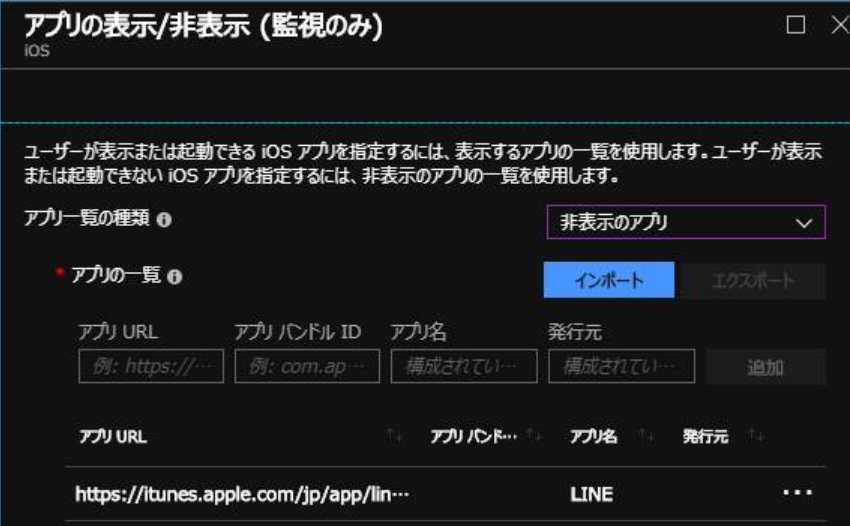

# Microsoft Intune の「制限付きアプリ」と「アプリの表示/非表示」機能について

※ 2018/9/26 追記

「制限付きアプリ」機能がコンプライアンス ポリシーの機能として復活し、利用できるようになりました。(iOS と Android Enterprise)

これにより、指定したアプリがインストールされている端末を「非準拠」と見なすことができます。

こんにちは。Microsoft Intune サポート チームです。
iOS を利用するユーザーから「端末で使用を許可／禁止するアプリを指定したい」という要望が多くあがります。
今回はそのための機能について説明します。

iOS 用のデバイス制限プロファイルでは、一見類似する 2 つの設定項目があります。
それが「制限付きアプリ」と「アプリの表示/非表示」機能です。
このうち「制限付きアプリ」機能は現在利用されておらず、「アプリの表示/非表示」機能を利用する必要があります。

## ■ アプリの表示/非表示機能
「アプリの表示/非表示」機能は、iOS 端末上に表示されるアプリを制限する機能です。
※ この機能を利用するには、iOS 端末を「[監視モード](https://support.apple.com/ja-jp/HT202837)」に設定する必要があります。
ホワイトリスト形式で、指定したアプリだけが表示されるようにしたり、ブラックリスト形式で指定したアプリを非表示にすることができます。
この機能で非表示状態になったアプリは、iOS 画面にアプリのアイコンが表示されないだけでなく、実際にそのアプリを使用することができません。
例えば、Word アプリを非表示にした場合、Outlook アプリに添付された Word ファイルを Word アプリで開くことができなくなります。

「アプリの表示/非表示」の設定画面はこのようになっています。

[アプリ URL] または [アプリ バンドル ID] でアプリを特定していますので、この 2 つのいずれかを正確に入力します。
- App Store に公開されているアプリであれば、[アプリ URL] で指定できます。
- iOS にビルトインされているアプリの場合は [アプリ バンドル ID] で指定できます。[組み込みアプリのバンドル ID 一覧](https://docs.microsoft.com/ja-jp/mem/intune/configuration/device-restrictions-ios#bundle-id-reference-for-built-in-ios-apps)
指定するアプリの数が多く、手動での登録がお手間になる場合は、アプリ一覧をインポート・エクスポートする機能もあります。

注意点としては、複数の「アプリの表示/非表示」プロファイルを同一の端末に展開するとエラーになる点です。
これは Apple Configurator のカスタム プロファイルを使用した場合も同様です。
「アプリの表示/非表示」設定は、1 デバイスに 1 プロファイルだけが割り当てられるようにしてください。

## ■ 制限付きアプリ機能について

※ 2018/9/26 追記

「制限付きアプリ」機能がコンプライアンス ポリシーの機能として復活し、利用できるようになりました。(iOS と Android Enterprise)

これにより、指定したアプリがインストールされている端末を「非準拠」と見なすことができます。

「制限付きアプリ」機能は元々 Intune のクラシック コンソール時代に利用されていた機能です。
Silverlight で動作する、以前のコンソールを覚えている方もいらっしゃるでしょう。
この機能では、「アプリの表示/非表示」のようにアプリの利用を禁止する直接的な効力はありませんでした。
管理者が指定したアプリが端末にインストールされているか、いないかという情報を端末側で監査し、クラシック コンソールのレポートで確認する機能でした。
Intune が Azure 管理ポータルに移行するにあたり、クラシック コンソールでの MDM 管理機能やレポート機能が廃止されております。

※移行はテナントごとに行われ、2017 年 10 月 ～ 2018 年 6 月頃には、実質的に「制限付きアプリ」機能は利用できない状態になっています。

一方で、デバイスからはインベントリとしてアプリの情報が収集されていますので、この情報を基に監査を行うことができます。
Azure ポータルの [Intune] - [モバイル アプリ] - [検出されたアプリ] には、インベントリされた全アプリの一覧が表示されます。
この情報をエクスポートして、監査に利用することができます。
企業所有端末からはインストールされた全アプリ情報が、個人所有端末からは Intune で管理されたアプリの情報のみが収集されます。

「制限付きアプリ」機能では、実質的に BYOD 端末について、ユーザーのアプリの情報を監査できるというプライバシー上の課題がありましたが、インベントリ機能ではこの課題は解消されています。

 

このように、「アプリの表示/非表示」機能を上手く活用することで、組織のアプリ使用を制限可能です。

また、インベントリ情報を活用することで、社給端末で利用されているアプリ情報を取得可能です。