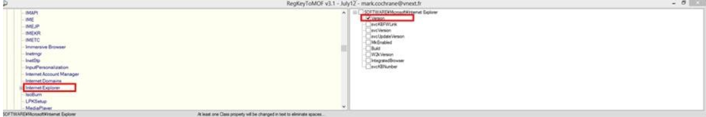
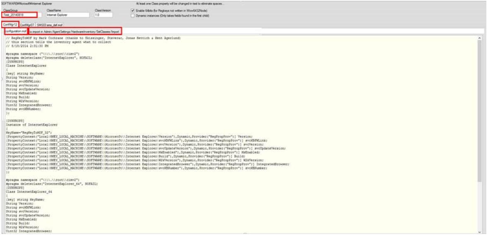
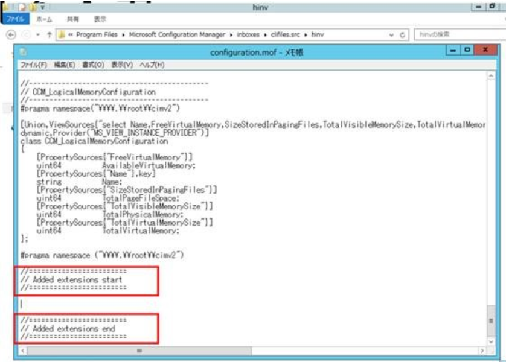
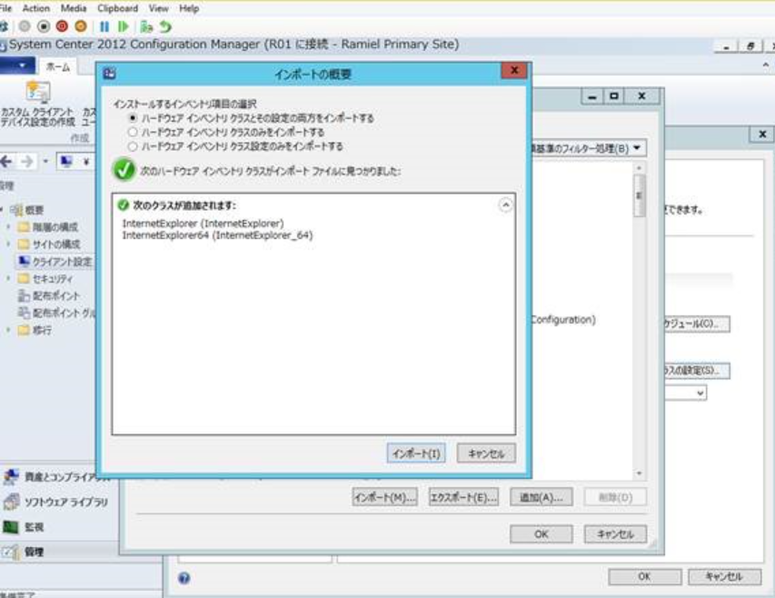
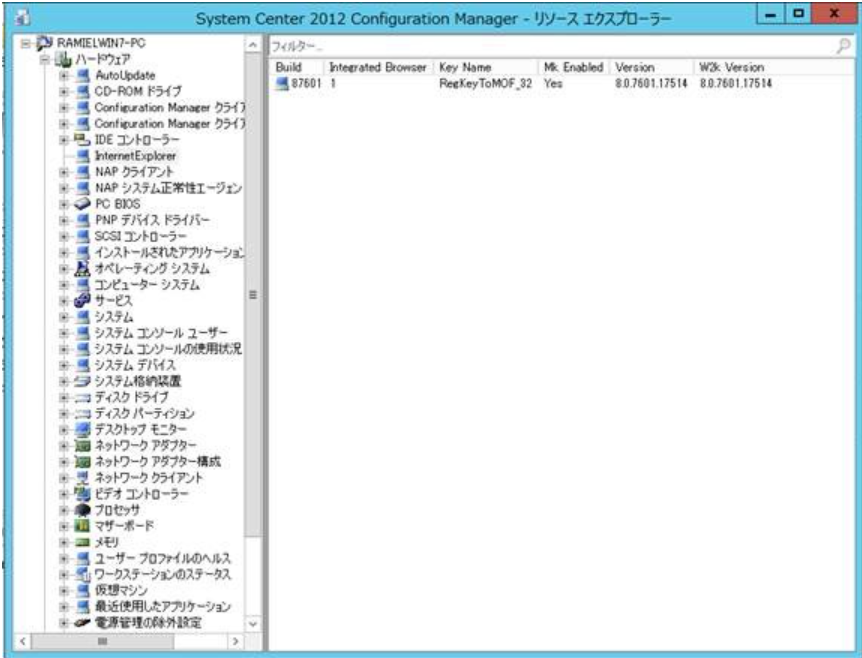

# 任意のレジストリ値を ハードウェア インベントリ として取得する方法

こんにちは。 System Center Configuration Manager サポート チームです。

今回は、System Center Configuration Manager (以下、Configuration Manager) でハードウェア インベントリで収集する情報を拡張する手順をご案内いたします。

Configuration Manager では、管理するクライアントの情報をインベントリ情報として収集することができます。既定で収集する情報以外にも、特定のレジストリ値を収集したいとご要望をいただくことが多々ありますので、手順を案内させていただきます。

今回の手順では Internet Explorer のバージョン情報を含む以下のレジストリ値を採取します。

キー： HKEY_LOCAL_MACHINE\SOFTWARE\Microsoft\Internet Explorer
値： Version

## Step1: MOF ファイルの作成
インベントリとして収集するための情報を拡張するには、MOF ファイルを作成する必要があります。本手順では、MOF ファイルを簡単に作成することができる、外部無料ツール RegKeyToMOF  を使用します。

1. [RegKeyToMOF](https://gallery.technet.microsoft.com/RegKeyToMof-28e84c28)  を起動し、画面左上から、採取したいキーを選択します。

（今回は Internet Explorer のバージョンを取るため、"Internet Explorer" キーをクリックします。）
次に右上の画面より、選択したキー配下の取得したい値を選択します。

2. "ClassGroup"  には任意の名前を入れ、ConfMgr12 が選択してあることを確認します。
そして、"configuration.mof"/ "to import In Admin/Agent Settings/HardwereInventory/SetClasses/Import" タブを、それぞれ、コピーして、メモ帳等に内容を貼り付け、拡張子を ".mof" にして、MOF ファイルとして保存します。

3. 検証用のコンピューターでコマンドプロンプトから手順 2. で作成した MOF ファイルのあるパスに移動し、以下を実行します。

mofcomp -check xxxx.mof （ xxxx には mof につけたファイル名を入れてください ）

構文チェックでエラーが出力されないことを確認してください。

## Step2: インベントリの収集対象としてクライアント側の名前空間 （ WMI ) を拡張する
使用する MOF ファイル： configuration.mof タブで作成した MOF ファイル
作業場所： Configuration Manager サイトサーバー（ CAS 環境の場合は、中央管理サイト ）

1. 以下のファイルをバックアップしておきます。
パス： < Configuration Manager インストール ディレクトリ>\inboxes\clifiles.src\hinv
バックアップ対象ファイル: configuration.mof

2.  configuration.mof　 ファイルをメモ帳で開き、上述で確認した“configuration.mof” タブの内容を 一番下にコピー（追記）して保存します。

具体的には、最後の "Added extensions start/ end" の 2 行の間に挿入します。

## Step3: サイトサーバー側でインベントリの収集対象に追加するために mof 定義を追加する
使用する MOF ファイル： to import In Admin/Agent Settings/HardwereInventory/SetClasses/Import タブで作成した MOF ファイル
作業場所：最上位の Configuration Manager サイトサーバー （ CAS 環境の場合は、中央管理サイト ）
1. 最上位の Configuration Manager サイト サーバー から、Configuration Manager コンソールを以下のとおり展開し、ハードウェア インベントリのクラスを追加します。

[管理] -> [概要] -> [クライアント設定] -> [既定のクライアント設定]

[ハードウェア インベントリ] ページを開き、[クラスの設定] で "手順 A." で作成した “to import in Admin/AgentSettings/HardwareInventory/SetClasses/Import” MOF ファイルをインポートし、当該ハードウェア インベントリ クラスにチェックをいれます。

## Step4: インベントリの収集ができているか確認する
MOF ファイルで定義したレジストリ値は、ハードウェア インベントリ データの 1 つとして収集されます。データがサイト サーバーに送信され、正常に処理が完了した時点で、データベースに格納されます。

また、クライアントは、サイト サーバーで設定されたスケジュールに従って、それぞれインベントリを収集します。インベントリの周期は、既定では 7 日毎に実行されるように設定されておりますので、クライアントに設定されたレジストリ値が、把握できるようになるまで、時間差が生じる可能性がございます。

上記作業後、動作を確認するには、検証用の Configuration Manager クライアント端末 1 台で手動でインベントリ収集サイクルを実行します。

1. Configuration Manager クライアント端末のコントロールパネルから、Configuration Manager を開き、"操作" タブから以下のサイクルを実行します。

[コンピューターポリシーの取得および評価サイクル]
[ハードウェア インベントリ サイクル]

反映されたポリシーを受信するまでに時間がかかる場合がありますので、テストの際は上記サイクルを何度か実行ください。

拡張したハードウェアインベントリが正常に収集されると、Configuration Manager コンソールから対象マシンを右クリックして、リソース エクスプローラーを起動することで、収集したレジストリ情報をご確認いただけます。

～ 補足 1 ～
今回は Internet Explorer の情報を具体例としてあげました。
64 bit OS 上で動作する Internet Explorer は 32bit 版と 64bit 版がございます。
64 bit OS では、32bit 版/ 64bit 版双方が、HKLM\Software\Microsoft\Internet Explorer と HKLM\Software\Wow6432Node\Microsoft\Internet Explorer の値として取得することができます。
リソースエクスプローラー上では、それぞれ InternetExplorer と InternetExplorer64 が表示されます。
(InternetExplorer64 に 64 bit OS で収集した Wow6432Node 配下の対象レジストリ値が格納されます。)
Wow6432Node 配下のレジストリ値も取得したい場合は、RegKeyToMOF ツールの“Enable 64bits (for Regkeys not written in Wow6432Node)” のチェックボックスをオンのまま MOF ファイルを作成してください。

～ 補足 2 ～
MOF ファイルでインベントリを拡張し、収集できるインベントリは HKLM 配下となり、HKCU 配下は拡張することはできません。

～ 参考情報 ～
MOF (Managed Object Format) ファイルのサンプル
http://msdn.microsoft.com/ja-jp/library/aa728809(v=vs.71).aspx

Managed Object Format (MOF)
http://msdn.microsoft.com/en-us/library/aa823192.aspx

Configuration Manager のハードウェア インベントリの拡張方法
http://technet.microsoft.com/ja-jp/library/gg712290.aspx

Configuration Manager のハードウェア インベントリ
http://technet.microsoft.com/ja-jp/library/gg682093.aspx

Enhansoft - How to Use RegKeyToMof -
http://be.enhansoft.com/post/2014/02/13/How-to-Use-RegKeyToMof.aspx

※ 弊社公式情報ではなく英語の記事ですが、Configuration Manager 2007 と 2012 間での RegKeyToMof 使用方法の違いが記載されているため、少しでもお役に立てばと思い紹介させていただきます。
コミュニティにおけるマイクロソフト社員による発言やコメントは、マイクロソフトの正式な見解またはコメントではありません。