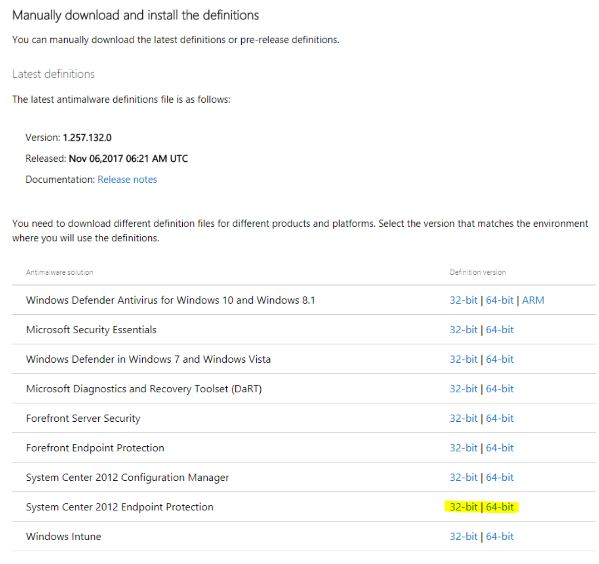

# System Center Configuration Manager クライアントがインストールされた PC でマスター イメージを取得する手順 (ワークグループ対応版)

皆様、こんにちは。System Center Configuration Manager サポート チームです。

今回は System Center Configuration Manager クライアントがインストールされた PC でマスター イメージを取得する手順をご紹介します。同様の手順については、こちらの技術情報でもご紹介しておりますが、本記事では展開後にドメインに参加せず、ワークグループ端末として利用する場合も考慮した手順であり、当サポート部門でもご案内した実績が多い手順でもありますので、お役立ていただけますと幸いです。なお、再イメージングする手順につきましては、次のブログ記事がお役立ていただけますので、こちらも合わせてご確認ください。

System Center Configuration Manager クライアントがインストールされた PC でマスター イメージを再取得する手順(https://docs.microsoft.com/ja-jp/archive/blogs/systemcenterjp/reimaging-master-sccm)

(留意事項)
System Center 2012 Configuration Manager SP2 / System Center 2012 R2 Configuration Manager SP1 エージェントの場合、ワークグループ環境にて自動割り当てができないという不具合が報告されています。この不具合に合致する場合、本手順を実施しても正常に自動割り当てができませんが、この不具合は CU2 以降で修正されておりますので、当該バージョンをご利用の場合は、CU2 以降のエージェントをご利用ください。(2018/1/23 時点で最新版は CU4 です。)

##対象製品

System Center 2012 Configuration Manager

System Center 2012 R2 Configuration Manager

System Center Configuration Manager Current Branch / LTSB

##手順

・前提条件
参照コンピューターは、SCCM サーバーとの通信ができない環境にした上で、下記手順を実施します。これは、準備中にサイト コードが割り当てられてしまうことを念のために防ぐためです。また、ネットワーク未接続の状態にすることは必須要件ではないので、サイト コードに割り当てられないようになっていることが担保できれば接続していても問題はございません。

・手順

次の手順を実施して、サイト コードをクリアし、一意の情報を削除してから、マスター イメージを採取します。

**1. サイト コード未割り当ての状態でエージェントをインストールする
**2. SMS Agent Host サービスの停止とスタート アップの種類の変更
**3. SCCM で使用する自己署名証明書を削除する
**4. SCCM 独自の信頼キーと管理ポイントの証明書を削除する
**5. SMSSLP または DNSSUFFIX のレジストリ値を設定する (任意)
**6. SMS Agent Host サービスのスタート アップの種類の変更
**7. マスターイメージの採取

5. の手順は SCCM 用に AD スキーマを拡張したドメイン環境に所属するクライアントでは必要ありません。各手順の詳細は以下の通りです。

**1. サイト コード未割り当ての状態でエージェントをインストールする

以下の手順にて、サイト コードが "未割り当て" の状態でエージェントのセットアップを行います。

1) サイト サーバーより、SCCM インストール フォルダー 配下に存在する Client フォルダーをコピーし保存します。インストール フォルダーの初期設定は以下になります。

\Program Files\Microsoft Configuration Manager\Client

2) 参照コンピューターにローカル管理者権限をもつユーザーでログインします。
3) 項番 1) でコピーした Client フォルダーを、クライアント上の任意のフォルダーに格納します。
4) サイト サーバーと通信できないようにするため、ネットワーク ケーブルを抜きます。
5) [管理者として実行] にてコマンド プロンプトを開き、cd コマンドでクライアントに格納した Client フォルダーに移動します。
6) 以下のコマンドを実行します。

ccmsetup.exe
※オプションなしで ccmsetup.exe を実行することにより、"未割り当て" の状態でエージェントがセットアップされます。

7) タスクマネージャーを起動して [プロセス] タブにて ccmsetup.exe が表示されなくなるまで待ちます。
8) [コントロール パネル] -> [システムとセキュリティ] -> [Configuration Manager] を開き、以下のようにサイト コードが "未割り当て" の状態であることを確認します。

[コンポーネント] タブ : 「CCM 通知エージェント」以外のすべての項目が「インストール済み」であることを確認します。

※ 「CCM 通知エージェント」は「無効」になります。
[サイト] タブ : 「現在の割り当てサイト コード」が空欄であることを確認します。

**2. SMS Agent Host サービスの停止とスタート アップの種類の変更

[管理ツール] - [サービス] を起動し、SMS Agent Host サービスを停止します。また、マスター イメージ採取前に自動でサービスが起動しないように、右クリックしてプロパティを開き、スタートアップの種類を [手動] に変更します。

**3. SCCM で使用する自己署名証明書を削除する

以下の手順で自己署名証明書を削除します。

1) コマンド プロンプトを開き、"mmc" を入力して実行します。
2) [ファイル] - [スナップインの追加と削除] をクリックします。
3) 左ペインから [証明書] をクリックして [追加] ボタンをクリックします。
4) "コンピューター アカウント" にチェックを入れて、[次へ] をクリックします。
5) "ローカル コンピューター" にチェックし、[完了] をクリックします。
6) 右ペインに "証明書（ローカル コンピューター）" が追加されていることを確認し [OK] をクリックします。
7) 左ペインにて、[証明書] - [SMS] - [証明書] を選択します。
8) 中央ペインに表示された 2 つの "SMS" 証明書に対して、それぞれ右クリックして [削除] を選択します。
「選択された証明書を永久的に削除しますか?」というメッセージが表示されますので、[はい] を選択します。
9) [ファイル] - [終了] をクリックします。「コンソールの設定を コンソール1 に保存しますか?」というメッセージが表示されますので、[いいえ] を選択して、mmc を終了します。

**4. SCCM 独自の信頼キーと管理ポイントの証明書を削除する

エージェントのインストール完了後に、もしネットワークに接続して、SCCM サーバー(管理ポイント サーバー) との通信が可能となった場合、参照コンピューターが、SCCM で使用する信頼キーと管理ポイントの証明書を WMI の中に保持した状態となる可能性があります。

この場合、参照コンピューターに保存されている信頼キーや管理ポイントの証明書を削除する必要があります。wbemtest より、WMI 名前空間 "root\ccm\locationservices" に接続できない場合は、SCCM サーバーと一度も接続がされていないため、問題ありません。接続できる場合は、情報を削除するため、以下の手順を実施してください。

以下の内容をサンプルとしてスクリプトを作成し、vbs ファイルとして保存します。本スクリプトを実行することで、信頼キーや管理ポイントの証明書も削除されます。

----- サンプルここから -----

dim oSMSClient
dim objLocator
dim objService

set objLocator = CreateObject("WbemScripting.SWbemLocator")
set objService = objLocator.ConnectServer(".", "root\ccm\locationservices")
set keys = objService.ExecQuery("select * from TrustedRootKey")

for each k in keys
k.delete_()
next

----- サンプルここまで -----

スクリプトを作成した後、参照コンピューターでコマンド プロンプトを "管理者として実行" にて起動し、以下のコマンドを実行します。

※) C:\Temp にスクリプト DeleteTRK.vbs を保存した場合
cd C:\Temp
cscript DeleteTRK.vbs

スクリプト実行完了後、以下の手順で、正常に信頼キーや証明書が削除されたことを確認します。

1) コマンド プロンプトを "管理者として実行" にて起動して wbemtest を実行し、"root\ccm\locationservices" 名前空間に接続します。
2)「スーパークラス名の入力」はブランクのまま、「クラスの列挙」を "再帰" を有効にして実行します。
3) 一覧から "TrustedRootKey" を選択し、ダブルクリックして開きます。
4) 開いた画面で「インスタンス」をクリックします。
5) インスタンスが存在しないことを確認します。

**5. SMSSLP または DNSSUFFIX のレジストリ値を設定する (任意)

ccmsetup.exe をオプションなしでインストールした場合、AD スキーマが拡張されており、サイト割り当ての境界グループが設定されていれば、次回起動後にサイトが自動的に割り当てられます。但し、AD スキーマを拡張していない場合やワークグループ端末の場合は、AD スキーマから情報を取得して自動でサイトを割り当てることができませんので、サイト割り当てができるように、SMSSLP または DNSSUFFIX のレジストリ値を設定することをご検討ください。SMSSLP のレジストリ値は ccmsetup.exe に SMSMP オプション、DNSSUFFIX のレジストリ値は、DNSSUFFIX オプションを付加してインストールした場合に、セットされるレジストリ値です。SMSSLP のレジストリ値の設定が必要である場合は、以下のレジストリ値に、割り当てるサイトの管理ポイント サーバーの FQDN 名をセットしてください。(対象端末から、名前解決できる FQDN 名であることが前提です。)

・SMSSLP
キーの場所 : HKEY_LOCAL_MACHINE\SOFTWARE\Microsoft\CCM
値の名前 : SMSSLP
値の種類 : REG_SZ

・DNSSUFFIX
キーの場所 : HKEY_LOCAL_MACHINE\SOFTWARE\Microsoft\CCM\LocationServices
値の名前 : DnsSuffix
値の種類 : REG_SZ

**6. SMS Agent Host サービスのスタート アップの種類の変更

[管理ツール] - [サービス] を起動し、SMS Agent Host サービスを右クリックしてプロパティを開き、スタートアップの種類を [自動（遅延開始）] に変更します。SMS Agent Host サービスを開始しないように注意してください。

**7. マスターイメージの採取

sysprep /generalize が実行された参照コンピューターをキャプチャして、マスター イメージを採取します。(System Center Configuration Manager のキャプチャー メディアを使用すれば、sysprep /generalize は内部的に自動実行されます。かつ上記情報の削除も内部的に実行されますのでキャプチャしたイメージを System Center Configuration Manager から展開する際には今回の記事でご案内した手順ではなくぜひ System Center Configuration Manager のキャプチャー メディアをご利用ください。)

(補足情報)

Windows 7 / Windows 8.1 環境において、同時に System Center Endpoint Protection (SCEP) クライアントをインストールする場合は、「7. マスターイメージの採取」の前に、次の手順を実施してください。

Configuration Manager で Endpoint Protection クライアントをディスク イメージにプロビジョニングする方法(https://docs.microsoft.com/ja-jp/previous-versions/system-center/system-center-2012-r2/dn236350(v=technet.10))

なお、手動適用するための SCEP 用の定義ファイルは、Microsoft Malware Protection Center より入手可能です。適用する定義ファイルは既定の設定にてご利用の場合にはネットワーク検査システムが有効であるため、以下の 2 種類です。

・ウイルス対策 / スパイウェア対策の定義ファイル

・ネットワーク検査システム定義ファイル

