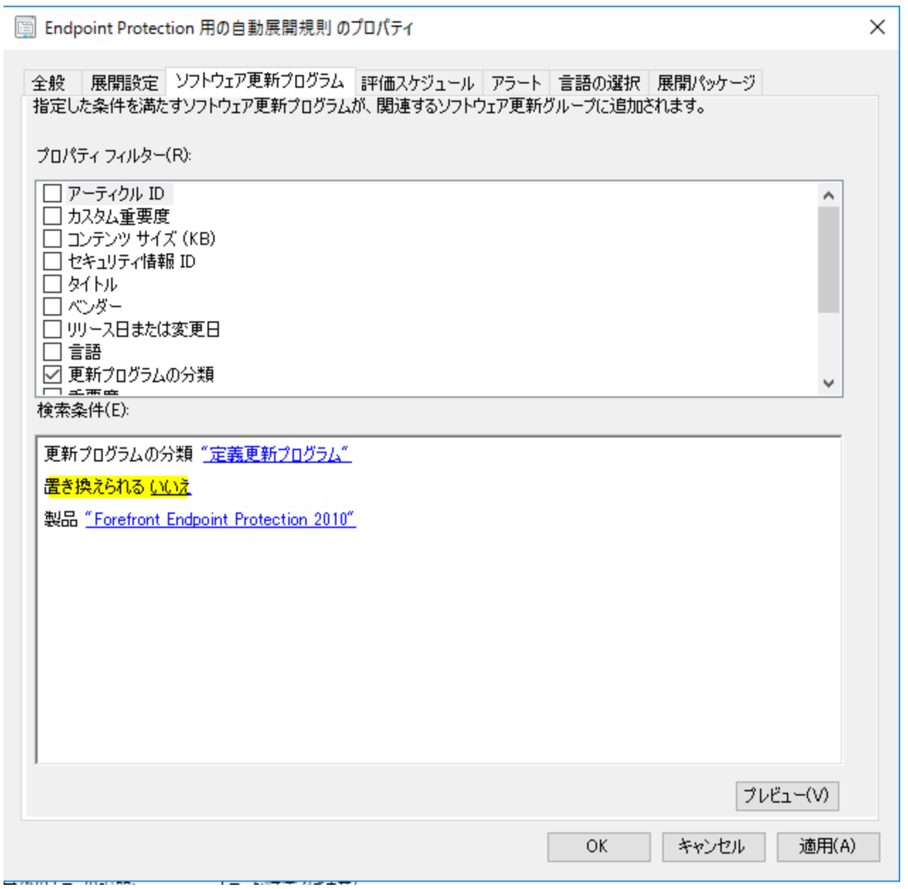
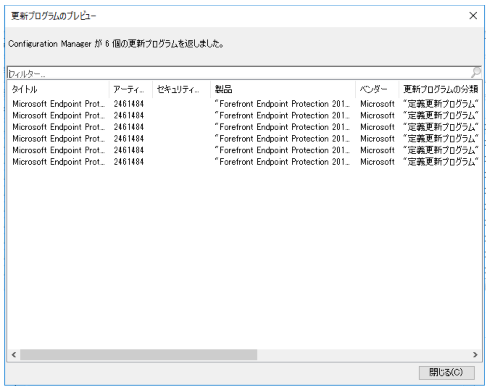

# System Center Endpoint Protection の定義ファイルのダウンロードの最適化について

みなさま、こんにちは。System Center Support Team です。

今回は System Center Endpoint Protection (以下、SCEP) 、または Windows Defender をご利用の皆様に、System Center Configuration Manager (以下、SCCM) から定義ファイルを配信する上でできる限りクライアントがダウンロードされる容量を少なくする方法についてご紹介いたします。

まず、SCEP の定義ファイルにつきましては、2018 年 3 月 8 日現在、1 日に 6 回リリースされております。このように毎日頻繁にリリースされるため、SCCM で配信する場合は、次の公開情報の通り、自動展開規則の機能を使用して、定義ファイルを配信する必要があります。

[定義ファイルの更新を配布するように自動展開規則を構成するには](https://docs.microsoft.com/ja-jp/sccm/protect/deploy-use/endpoint-definitions-configmgr)

「置き換えられる」を「いいえ」に設定しなかった場合、 SCEP 定義ファイルの展開は可能ですが、上述の通り 1 日 6 回リリースされますので、以下の通り 6 つの定義ファイルが展開されることになります。

定義ファイルを最新化するためには、最新の 1 つの定義ファイルのみダウンロードされればよいのですが、「置き換えられる」：「いいえ」を設定しなかった場合、最大で 6 つの定義ファイルがクライアントにダウンロードされることになります。これでも最新の定義ファイルのインストールが完了すれば、定義ファイルは最新化されますが、本来は 1 つの定義ファイルのみダウンロードすれば良いにもかかわらず、古い定義ファイルもダウンロードされることになりますので、適用までに時間を要する、もしくはクライアントと配布ポイント間のネットワーク トラフィックが増大する可能性があります。

そのため、もしクライアントと配布ポイント間のトラフィックにおいて、SCEP 定義ファイルのダウンロードにかかるサイズが大きくなっている場合は、上述の設定をすることで、低減できますのでご確認くださいますようお願いいたします。

また、SCEP 定義ファイルは 1 つの定義ファイルにつき、6 世代前までの差分の定義ファイルを持っておりますので、1 日複数回など頻繁に更新を行うことで、ダウンロードされる定義ファイルのサイズも少なくなります。こちらもクライアントと配布ポイント間のネットワーク トラフィックを低減させる方法の 1 つですので、ご検討くださいませ。

