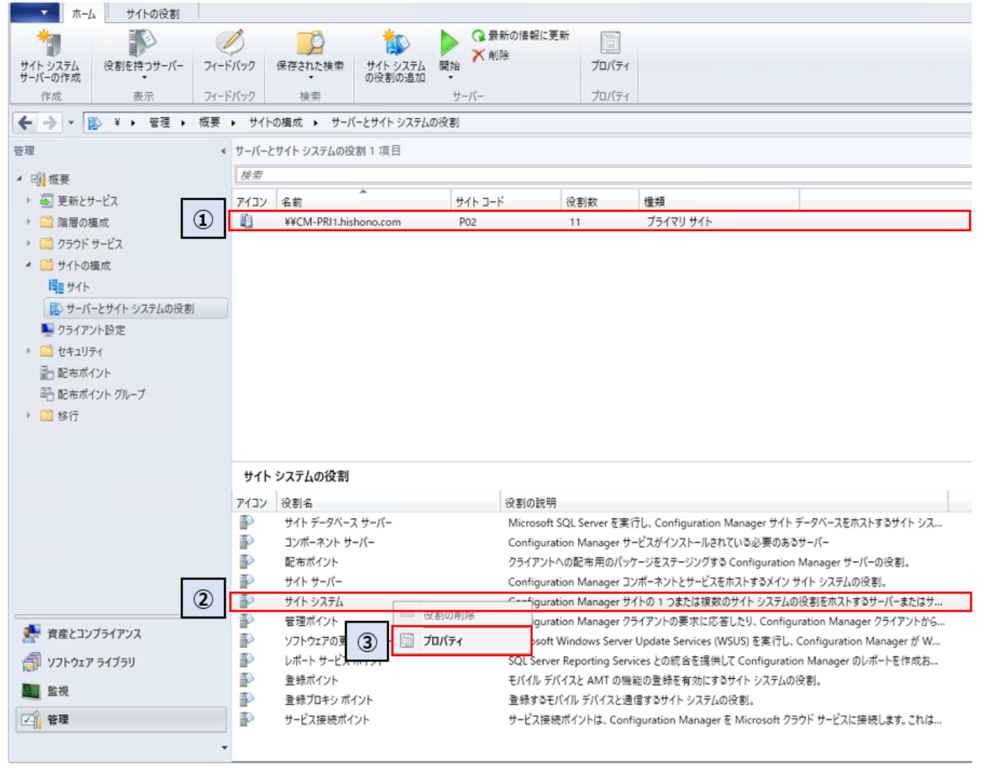
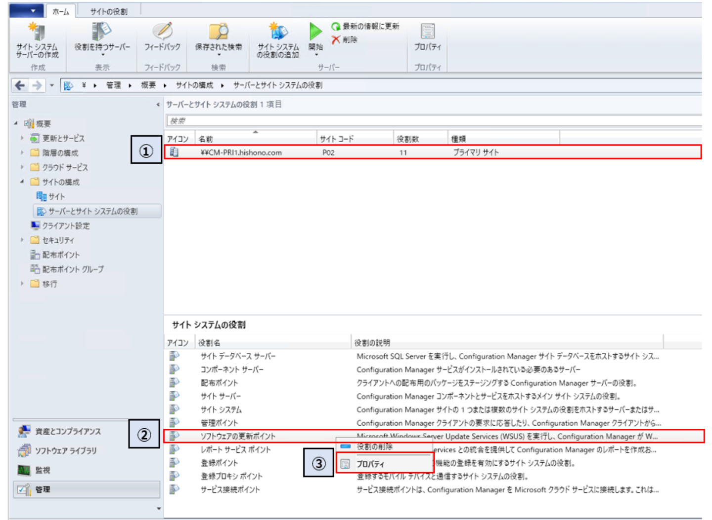
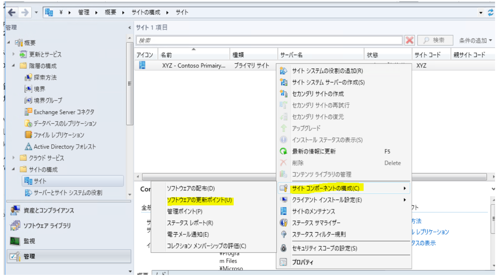
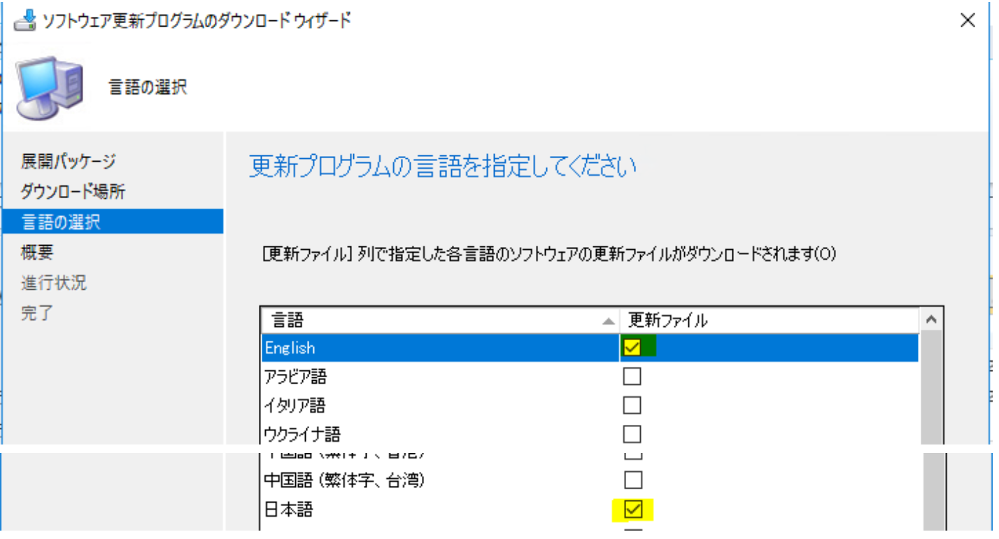

# System Center Configuration Manager に Office 365 Pro Plus の更新プログラムを同期する際の注意事項

みなさま、こんにちは。System Center Configuration Manager Support Team です。

今回は最近お問い合わせが多い Office 365 Pro Plus の更新プログラムを管理する際の注意事項についてご案内いたします。

- 要件の確認
- サイト システムのプロキシ サーバー設定
- ソフトウェアの更新ポイントのプロキシ サーバー設定
- ソフトウェア更新ポイントの言語の設定

# 要件の確認

Office 365 更新プログラムを管理する場合、階層の最上位の WSUS サーバーだけでなく、__最上位のサイト サーバーにおいても、インターネットへのアクセスが必要です。__ 通常の更新プログラム管理においては、サイト サーバーのインターネット接続は必須要件ではありませんが、Office 365 更新プログラムの管理では必須となりますので、ご注意ください。そのため、完全なオフライン環境では SCCM による Office 365 更新プログラムの管理はできません。その他要件につきましては、次の公開情報に記載しておりますので、ご確認ください。

[Configuration Manager を使用して Office 365 クライアントの更新を管理するための要件](https://docs.microsoft.com/ja-jp/DeployOffice/manage-updates-to-office-365-proplus-with-system-center-configuration-manager#BKMK_Reqs)

# サイト システムのプロキシ サーバー設定

SCCM 評価ガイドの ['Office 365 ProPlus 展開・アップデート編'](https://download.microsoft.com/download/F/0/D/F0D20D4C-B594-4341-924C-55DFF50FED88/SCCM_EvalGuide_O365ProPlus_jp.docx) のソフトウェア更新ポイントの追加手順はプロキシ サーバーを利用せずに Microsoft Update サイトから更新プログラムを同期することが前提となった手順になっております。

そのため、Microsoft Update サイトから更新プログラムを同期する際にプロキシ サーバーを利用する環境においては以下の追加設定を実施いただきますよう宜しくお願い致します。

[ソフトウェアの更新ポイント] の役割をもつサーバーの [サイト システム] の設定にて、以下を追加下さい。

1. SCCM の管理コンソールにて、[管理] - [概要] - [サイトの構成] - [サーバーとサイト システムの役割] からソフトウェアの更新ポイントの役割を持つサーバーを選択します。

2. [サイト システムの役割] から、[サイト システム] を選択します。

3. 右クリックし、[プロパティ] を選択します。

4. [サイト システムのプロパティ] より、[プロキシ] タブを選択します。

5. [プロキシ] タブにて、[インターネットから情報を同期するときにプロキシ サーバーを使用する] にチェックを入れ、[プロキシ サーバー名] および [ポート] を設定します。

6. [OK] を選択し、[サイト システムのプロパティ] を閉じます。

# ソフトウェアの更新ポイントのプロキシ サーバー設定

[ソフトウェアの更新ポイント] の役割をもつサーバーの [ソフトウェアの更新ポイント] の設定にて、以下を追加下さい。

1. SCCM の管理コンソールにて、[管理] - [概要] - [サイトの構成] - [サーバーとサイト システムの役割] からソフトウェアの更新ポイントの役割を持つサーバーを選択します。

2. [サイト システムの役割] から、[ソフトウェアの更新ポイント]を選択します。

3. 右クリックし、[プロパティ]を選択します。

4. [ソフトウェアの更新ポイントのプロパティ] より、[プロキシとアカウントの設定] タブを選択します。

5. [プロキシとアカウントの設定] タブにて、[ソフトウェア更新プログラムを同期するときにプロキシ サーバーを使用する] および [自動展開規則を使用してコンテンツをダウンロードするときにプロキシ サーバーを使用する] にチェックを入れます。

6. [OK] を選択し、[ソフトウェア更新ポイントのプロパティ] を閉じます。

（※）自動展開規則を使用しない場合でも、Office 365 の更新プログラムをプロキシ経由で同期する場合は、⑤ のチェックをオンにする必要があります。

# ソフトウェア更新ポイントの言語の設定

クライアントが複数の言語の Office 環境の場合は、Office の更新プログラムにつきましても、クライアントにインストールされているすべての言語モジュールをダウンロードする必要があります。複数の言語の Office 環境の場合は、以下の追加設定を実施いただきますよう宜しくお願い致します。

以下の手順では、英語と日本語版の環境を例えております。

[ソフトウェアの更新ポイント] がインストールされているすべてのサイトにおいて、ソフトウェア更新ポイントのプロパティ画面の [言語] タブにて、"英語" や "日本語" を選択します。

その他、お客様の言語環境に応じて、必要な言語を追加してください。

言語の追加後には、スケジュール同期や手動にての同期により、指定した言語のメタデータが同期されるようになります。

また、更新プログラムを展開パッケージにダウンロードする際には、必ず、お客様の言語環境に合わせて、必要とされる言語をすべて選択し、ダウンロードして頂ますようお願いいたします。

