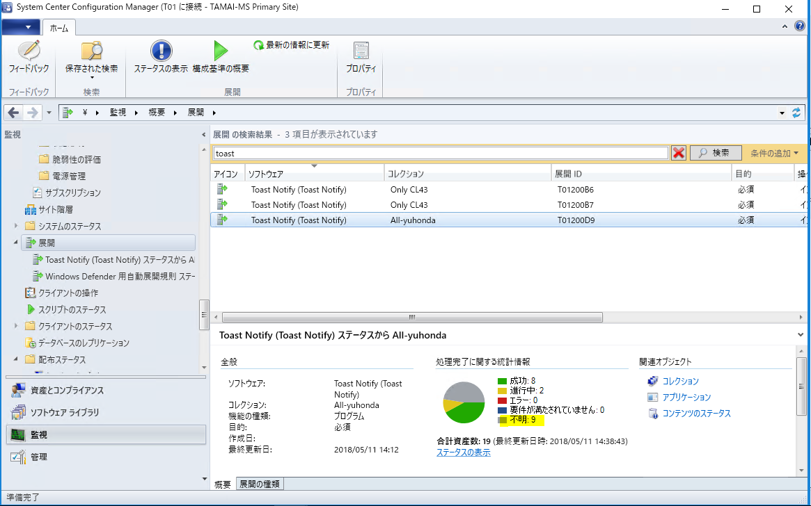
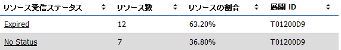
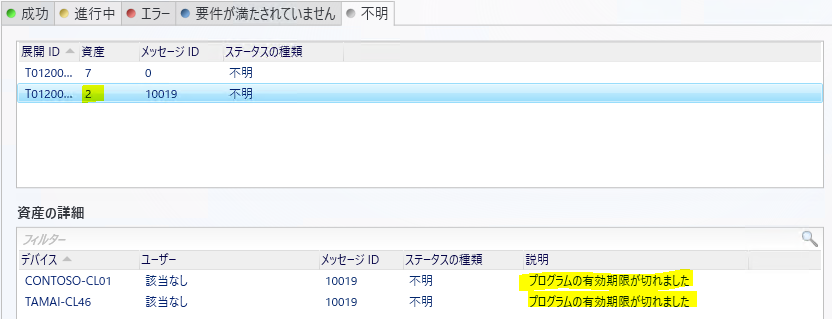
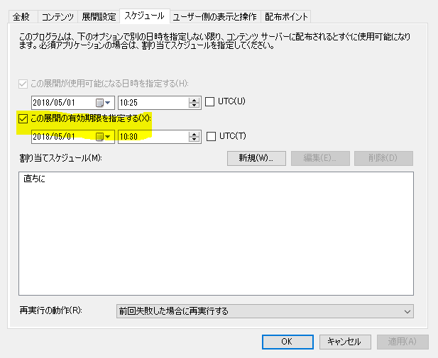

# 「指定したパッケージおよびプログラムの展開のステータス」レポートについて

みなさま、こんにちは。System Center Support Team です。

今回は System Center Configuration Manager でパッケージ機能で配布したソフトウェアの展開状況を確認するためのレポートの 1 つである「指定したパッケージおよびプログラムの展開のステータス」レポートと「展開ステータス」の関連付けについてご紹介いたします。

 
「指定したパッケージおよびプログラムの展開のステータス」は、パッケージ機能でソフトウェアを配信した後の展開状況を確認するために役立ちます。「ターゲット リソースのステータス」では、展開の進行状況、リソース受信ステータスでは展開を受信していない端末も含めて、全台の状況を把握することができます。

一方、管理コンソールの [監視] - [展開] で展開ステータスからも全台の状況を把握することができますが、本レポートの「リソース受信ステータス」で表示されている No Status のリソース数と展開ステータスの統計情報に表示されている「不明」のリソース数の数が合わず、どちらが正しいのかわからないといったご意見をいただくことがございます。

例えば、以下の展開ステータスでは不明が「9」ですが、上記レポートでは No Status が「7」となっており、一見すると台数が一致していません。

これは Expired に「不明」ステータスの端末がカウントされていることによりますが、レポートの「リソース受信ステータス」と展開ステータスの各項目が以下の通り関連付いていることをおさえておけば、理解しやすくなります。

| リソース受信ステータス | 展開ステータス|
|:--------------------:|:--------------:|
| Accepted	 | 進行中 |
|Expired     |	成功 or 不明 |
|No Status	 |不明|

例えば、上記例においてリソース受信ステータスの No Status の台数は 7 台です。

一方、展開ステータスをみると不明は 9 台になっています。ただし、内訳をみると、9 台中 2 台が「有効期限切れ」になっていることがわかります。この 2 台はリソース受信ステータスでは Expired に分類されています。

もし、「リソース受信ステータス」と「展開ステータス」の台数が一致しない場合は、Expired のステータスによる影響がありますので、ご留意いただければと存じます。

(補足)

Expired は、パッケージの展開の「スケジュール」で設定した「この展開の有効期限を指定する」で指定した時刻が過ぎている場合のステータスです。

一方、展開ステータスをみると不明は 9 台になっています。ただし、内訳をみると、9 台中 2 台が「有効期限切れ」になっていることがわかります。この 2 台はリソース受信ステータスでは Expired に分類されています。

