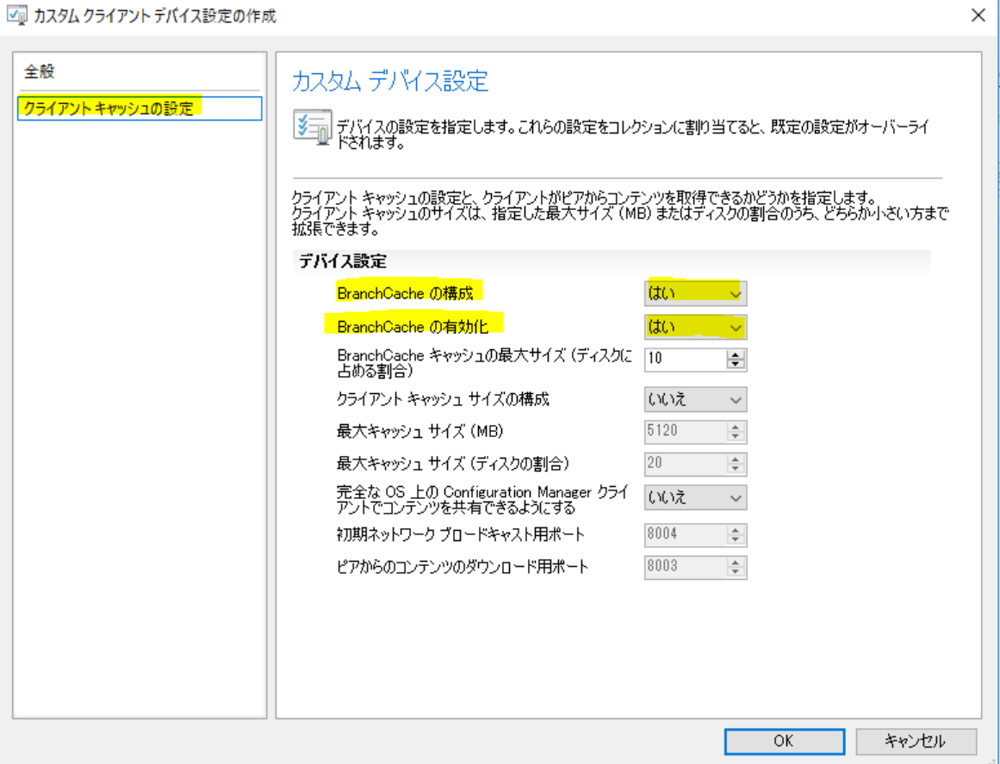

# System Center Configuration Manager における BranchCache、ピアキャッシュ機能について - その 1 (概要編)

みなさま、こんにちは。

日本マイクロソフト System Center Configuration Manager サポートの金です。

 

SCCM を運用されている中で、ネットワーク回線が細い拠点を管理対象としている場合、コンテンツの配布によるネットワークの負荷を分散させる工夫が必要な場面がございます。

本日は、コンテンツの配布の際にネットワークの負荷を軽減できる BranchCache の機能や、ピアキャッシュの機能の概要についてご紹介させていただきますので、お役立ていただけますと幸いでございます。

 これから案内させていただく内容は、以下の流れになります。

---------------------------------------------------------------

1. BranchCache / ピアキャッシュ機能のご説明

2. BranchCache / ピアキャッシュ機能の設定箇所

3. ピアキャッシュ ログの確認方法

---------------------------------------------------------------

以下は、詳細内容となります。

## 1. BranchCache / ピアキャッシュ機能のご説明

BranchCache 機能とピアキャッシュ機能は、個別に利用することも、両方同時に利用することも可能でございます。

両機能を同時にご利用の場合は、ピアキャッシュの機能が優先的に動作します。

以下に、それぞれの機能の詳細についてご記載いたします。

  

### (1) BranchCache 機能について

BranchCache 機能は、Windows OS 固有の機能で、SCCM と連携してお使いいただけます。

 

### (1) - 1. 機能の特徴

BranchCache 機能の特徴といたしましては、以下のようなものがございます。

- ログが出力されないため、動作確認には Performance Monitor 等の別途ツールが必要となる

- 更新プログラム、パッケージ、タスク シーケンスは展開可能だが、WinPE を利用した OS 展開はできない

- キャッシュフォルダーを別途使用する

%Windir%\ServiceProfile\NetworkSerivce\AppData\PeerDistPub

- マルチキャスト通信を使用するため、同じサブネットでのみ使用可能である

- データのやり取りは、ブロック単位で行われる

 

### (1) - 2. 設定時の挙動

BranchCache を有効と設定した場合、コンテンツを展開した際に、以下のように挙動します。

1. SCCM からコレクションに対して、コンテンツを展開し、コンテンツが配布ポイントに配布されます。

2. 端末 A が、同じサブネットにある端末に対して、コンテンツのキャッシュがないか探索します。

3. キャッシュが見つからなかった場合、配布ポイントからダウンロードを行います。

4. 端末 A は、ダウンロードしたコンテンツの一部のブロックをキャッシュします。

5. 端末 B が、同じサブネットにある端末に対して、コンテンツのキャッシュがないか探索します。

6. 端末 A から、コンテンツの一部のキャッシュが見つかったため、ダウンロードを行います。

7. 端末 B は、同じサブネットにある端末に対して、残りのコンテンツのキャッシュを探索します。

8. 端末 C から、コンテンツの一部のキャッシュが見つかったため、ダウンロードを行います。

9. 端末 B は、同じサブネット上で、コンテンツのキャッシュが見つからなくなるまで上記の動きを繰り返し、最終的に見つからなかった部分については、配布ポイントからダウンロードを行います。

10. 端末 B は、ダウンロードしたコンテンツの一部をキャッシュします。

  

### (2) ピアキャッシュ機能について
ピアキャッシュは、SCCM 独自の機能となり、SCCM cb 1610 でプレリリースされ、1710 から正式にサポートしております。

 

### (2) - 1. 機能の特徴

ピアキャッシュの特徴は、以下のようなものがございます。

- ログが出力されるため、動作確認が可能である

- 更新プログラム、パッケージ等はもちろん、OS も展開可能である

- SCCM のキャッシュフォルダーの ccmcache を使用する

%Windir%\ccmcache

- サブネットが異なる場合でも、境界グループ内であれば使用可能である

- データのやり取りは、パッケージ単位で行われる

- SCCM コンソールから、ピアキャッシュのダウンロード状況が確認可能である

### (2) - 2. 留意点

バージョン 1702 以降からは、以下のいずれかの条件に合致した場合、アクセスが制限されますので、ご留意ください。

詳しくは、下記のご参考資料 1 をご覧ください。

- バッテリ低下モードの場合。

- コンテンツの要求時に CPU 負荷が 80% を超えている場合。

- ディスク I/O の AvgDiskQueueLength が 10 を超えている場合。

- 新たにコンピューターに接続できない場合。

 

### (2) - 3. 設定時の挙動

ピアキャッシュを有効と設定した場合、コンテンツを展開した際に、以下のように挙動します。

1. SCCM からコレクションに対して、コンテンツを展開し、コンテンツが配布ポイントに配布されます。

2. ピアキャッシュ ソースとして設定されている端末 A が、管理ポイントに対して、コンテンツのダウンロードが可能な場所を問い合わせます。

3. 管理ポイントは、端末 A と同じ境界グループの中で、コンテンツのダウンロードが可能な場所のリストを返します。

4. 管理ポイントからのリストには、配布ポイントの場所のみがあったため、端末 A は、配布ポイントからコンテンツのダウンロードを行います。

5. 端末 A は、管理ポイントに、自分が持っているキャッシュの情報を報告します。

6. 管理ポイントは、同じコンテンツのダウンロード場所をリクエストしてくる端末 B に対して、端末 A と配布ポイントの場所を返します。

7. 端末 B は、端末 A、配布ポイントのどちらかからコンテンツをダウンロードします。

端末 B が、ピアキャッシュ ソースとして設定されていない場合は、ここで処理が完了し、ピアキャッシュ ソースとして設定されている場合は、管理ポイントに、自分が持っているキャッシュの情報を報告します。

 

< ご参考資料 >

1. "Configuration Manager クライアントのピアキャッシュ"

ピアキャッシュの機能の詳細については、以下の公開資料がございます。

https://docs.microsoft.com/ja-jp/mem/configmgr/core/plan-design/hierarchy/client-peer-cache

 

2. "BranchCache vs. Peer Cache" (英文)

以下は、英文となっておりますが、BranchCache と ピアキャッシュの差異について

記載されており、機能の導入をご検討される際に、お役立ていただけますと幸いです。

https://blogs.technet.microsoft.com/swisspfe/2018/01/25/branch-cache-vs-peer-cache/

## 2. BranchCache / ピアキャッシュ機能の設定箇所

以下に、それぞれの機能を利用するにあたり、必要な設定箇所を記載させていただきます。

### (1) BranchCache 機能の設定箇所

1. 配布ポイントの役割を持つサイト サーバーに、BranchCache 機能を追加します。

2. [Configuration Manager コンソール] - [管理] - [概要] - [配布ポイント] から、配布ポイントのプロパティを開き、

[全般] タブで、"この配布ポイントの BranchCache を有効にして構成する" にチェックを入れ、適用します。

3. [Configuration Manager コンソール] - [管理] - [概要] - [クライアント設定] から、

以下のカスタム クライアント設定を作成し、お客様の環境に合わせて設定後、コレクションに展開します。

"クライアント キャッシュの設定"

- BranchCache の構成 : "はい"

- BranchCache の有効化 : "はい"

その他の項目は、任意で設定してください。

4. コンテンツを展開する際に、展開ウィザードの [配布ポイント] の画面で、以下にチェックを入れます。

"同じサブネットにあるほかのクライアントとのコンテンツの共有を許可する"

## (2) ピアキャッシュ機能の設定箇所

1. ピアキャッシュ機能を有効とする境界グループを作成します。

2. [Configuration Manager コンソール] - [資産とコンプライアンス] - [概要] - [デバイス コレクション] から、

新しいデバイス コレクションを作成し、ピアキャッシュ ソースとして指定したいデバイスを追加します。

3. [Configuration Manager コンソール] - [管理] - [概要] - [クライアント設定] から、

カスタム クライアント設定を作成し、お客様の環境に合わせて設定後、コレクションに展開します。

"クライアント キャッシュの設定"

- 完全な OS 状の Configuration Manager クライアントでコンテンツを共有できるようにする : "はい"

- 初期ネットワーク ブロードキャスト用ポート: "任意" (既定 8004)

- ピアからのコンテンツのダウンロード用ポート : "任意" (既定 8003)

その他の項目は、任意で設定してください。

< ご参考資料 >

以下の資料に、クライアント設定の詳細が記載されております。

"System Center Configuration Manager のクライアント設定について"

- "クライアント キャッシュ設定"

https://docs.microsoft.com/ja-jp/mem/configmgr/core/clients/deploy/about-client-settings#client-cache-settings

## 3. ピアキャッシュ ログの確認方法
ピアキャッシュ機能を有効にし、最初のピアキャッシュ ソース クライアントが配布ポイントからコンテンツをダウンロードした後、以下のログに、コンテンツがキャッシュされたことが出力されます。

### StateMessage.log

------------ 出力例 ------------

Adding message with TopicType 7200 and TopicId Cache add T020000B.1 to WMI StateMessage 2018/05/17 10:41:59 36728 (0x8F78) State message(State ID : 1) with TopicType 7200 and TopicId Cache add T020000B.1 has been recorded for SYSTEM StateMessage 2018/05/17 10:41:59 36728 (0x8F78) Successfully forwarded State Messages to the MP StateMessage 2018/05/17 10:43:00 36728 (0x8F78)

------------ 出力例 ------------   他のクライアントが、ピアキャッシュ ソースとなっているクライアントから、コンテンツをダウンロードする際は、以下の 3 つのログに、その旨が出力されます。

### CAS.log

------------ 出力例 ------------

**** Received request for content T020000B.1, size(KB) 737, under context System with priority Low. ContentAccess 2018/05/17 10:47:03 3228 (0x0C9C)
CacheManager: There are currently 0 bytes used for cached content items (0 total, 0 active, 0 tombstoned, 0 expired). ContentAccess 2018/05/17 10:47:03 3228 (0x0C9C)

(中略)

Download started for content T020000B.1 ContentAccess 2018/05/17 10:47:04 3228 (0x0C9C)
Location update from CTM for content T020000B.1 and request {A6D8A569-FDC5-48DA-9CEC-5F77D27663B9} ContentAccess 2018/05/17 10:47:04 3712 (0x0E80)
Matching DP location found 0 - https://contoso-cl04.contoso.local:8003/sccm_branchcache$/t020000b (Locality: PEER) ContentAccess 2018/05/17 10:47:04 3712 (0x0E80)
Matching DP location found 1 - http://tamai-cm02.tamai-ms.local/sms_dp_smspkg$/t020000b (Locality: BOUNDARYGROUP) ContentAccess 2018/05/17 10:47:04 3712 (0x0E80)
Download request only, ignoring location update ContentAccess 2018/05/17 10:47:04 3712 (0x0E80)

------------ 出力例 ------------

 

### ContentTransferManager.log

------------ 出力例 ------------

Starting CTM job {18E631ED-390B-4725-9010-1F9132E4BD7F}. ContentTransferManager 2018/05/17 10:47:03 3228 (0x0C9C)
Created CTM job {18E631ED-390B-4725-9010-1F9132E4BD7F} for user S-1-5-18 ContentTransferManager 2018/05/17 10:47:03 3228 (0x0C9C)
Created and Sent Location Request '{21A682C1-51B7-4C63-9FBE-ED3141CEEC29}' for package T020000B ContentTransferManager 2018/05/17 10:47:04 3712 (0x0E80)
CTM job {18E631ED-390B-4725-9010-1F9132E4BD7F} entered phase CCM_DOWNLOADSTATUS_WAITING_CONTENTLOCATIONS ContentTransferManager 2018/05/17 10:47:04 3712 (0x0E80)
Queued location request '{21A682C1-51B7-4C63-9FBE-ED3141CEEC29}' for CTM job '{18E631ED-390B-4725-9010-1F9132E4BD7F}'. ContentTransferManager 2018/05/17 10:47:04 3712 (0x0E80)
Persisted locations for CTM job {18E631ED-390B-4725-9010-1F9132E4BD7F}:
(PEER) https://CONTOSO-CL04.CONTOSO.local:8003/SCCM_BranchCache$/T020000B (BOUNDARYGROUP) http://TAMAI-CM02.tamai-ms.local/SMS_DP_SMSPKG$/T020000B ContentTransferManager 2018/05/17 10:47:04 2352 (0x0930)

(中略)

CTM job {18E631ED-390B-4725-9010-1F9132E4BD7F} successfully processed download completion. ContentTransferManager 2018/05/17 10:47:52 3712 (0x0E80)cess 2018/05/17 10:47:04 3712 (0x0E80)

------------ 出力例 ------------

 

### DataTransferService.log

------------ 出力例 ------------

DTSJob {CCB7F7D2-8E93-47F1-9BCB-AAFB4CF93C0F} created to download from 'https://CONTOSO-CL04.CONTOSO.local:8003/SCCM_BranchCache$/T020000B' to 'C:\Windows\ccmcache\1'. DataTransferService 2018/05/17 10:47:05 2352 (0x0930)
DTSJob {CCB7F7D2-8E93-47F1-9BCB-AAFB4CF93C0F} in state 'DownloadingManifest'. DataTransferService 2018/05/17 10:47:05 3712 (0x0E80)
Raising event:
instance of CCM_CcmHttp_Status
{
ClientID = "GUID:64C1E4AF-793E-4B65-BBD9-8DC0C33E7087";
DateTime = "20180517014712.077000+000";
HostName = "CONTOSO-CL04.CONTOSO.local";
HRESULT = "0x00000000";
ProcessID = 2316;
StatusCode = 0;
ThreadID = 2248;
};

(中略)

DTS job {CCB7F7D2-8E93-47F1-9BCB-AAFB4CF93C0F} has completed:
Status : SUCCESS,
Start time : 05/17/2018 10:47:05,
Completion time : 05/17/2018 10:47:52,
Elapsed time : 47 seconds DataTransferService 2018/05/17 10:47:52 3500 (0x0DAC) 

------------ 出力例 ------------

