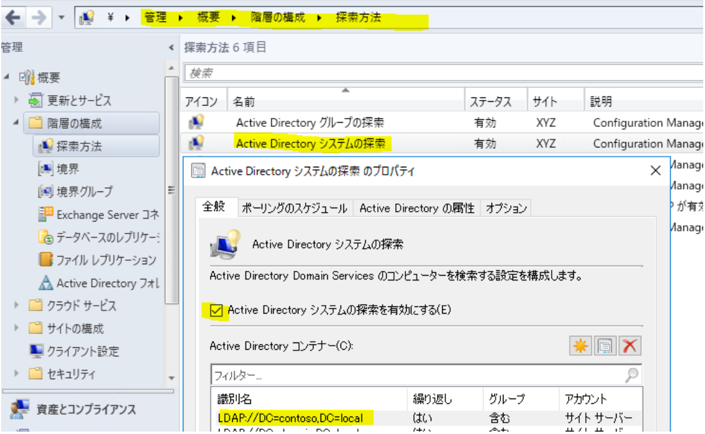
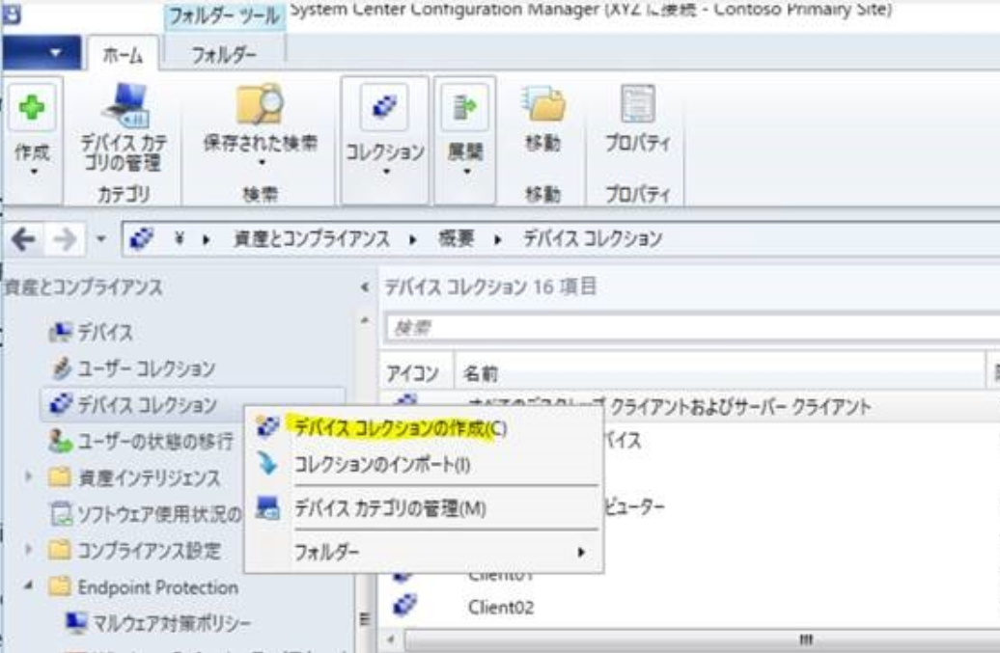
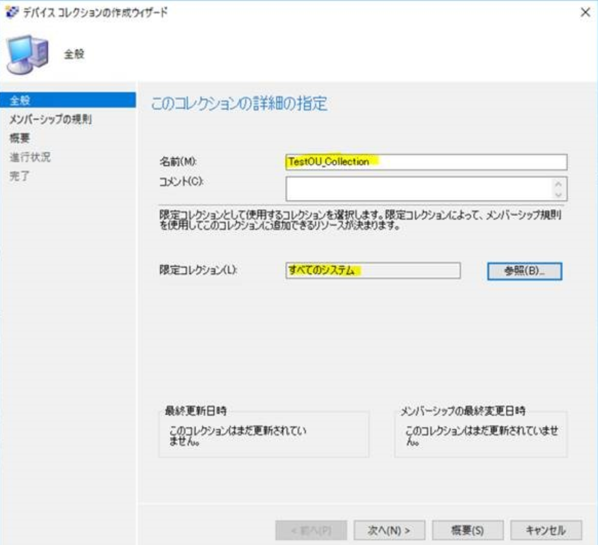
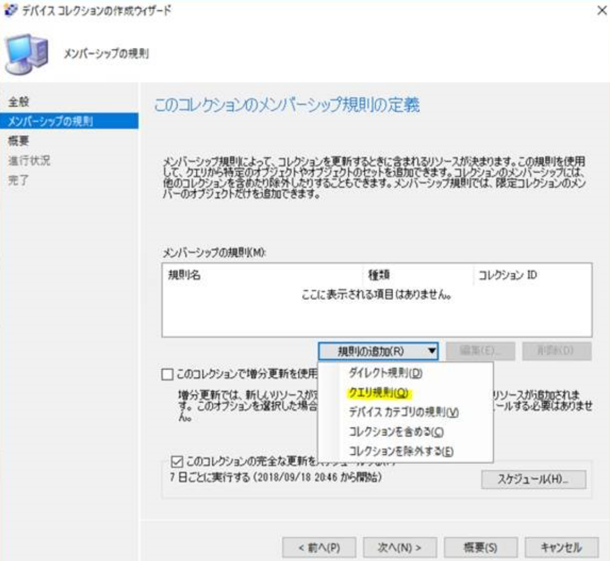
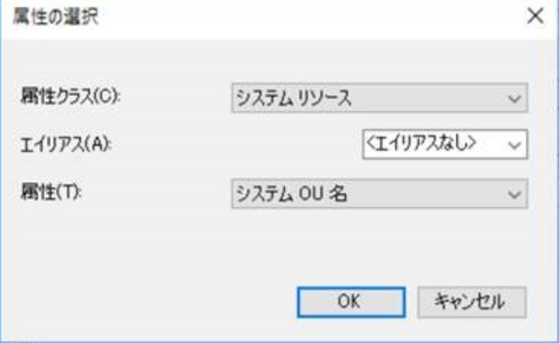
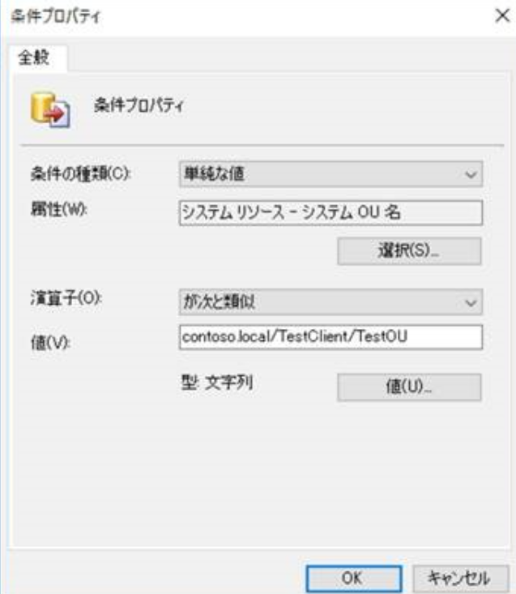
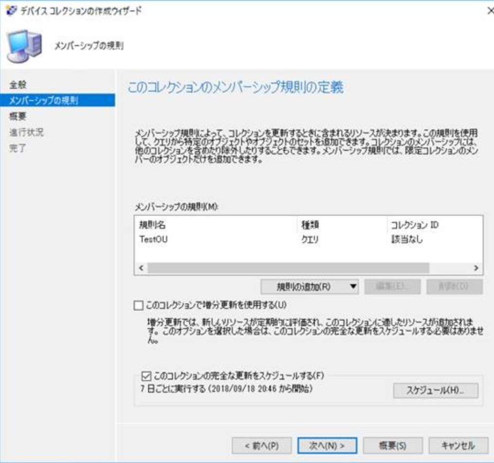
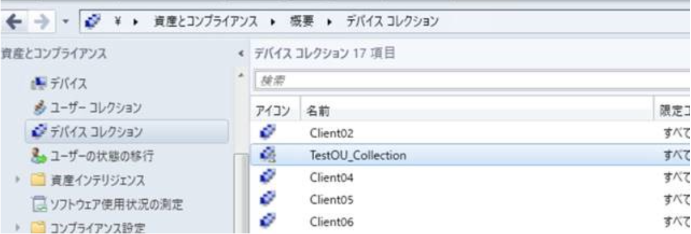
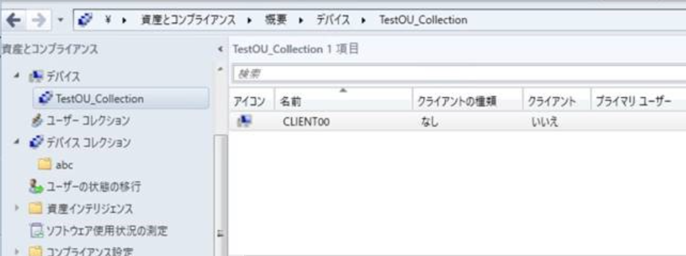

# System Center Configuration Manager AD OU に基づくデバイス コレクションの作成について

みなさま、こんにちは。

日本マイクロソフト System Center Configuration Manager サポートの金です。

本日は、System Center Configuration Manager Current Branch (以下、SCCM CB) にて、Active Directory の組織単位 (以下、OU) に基づいて、デバイス コレクションを作成する方法をご紹介させていただきます。

## 前提条件

---

AD の OU に基づくコレクションの作成の際には、事前に、Active Directory システムの探索が実施されている必要があります。

SCCM の探索方法から、"Active Directory システムの探索" が正しく設定され、有効になっていることを確認してください。 

## 手順

---

本手順では、以下の OU をサンプルとしておりますので、お客様の環境に応じて、設定内容を変更していただきますようお願いいたします。

contoso.local/TestClient/TestOU 

1. SCCM プライマリ サイト サーバーにサインインし、[Configuration Manager コンソール] を開きます。

2. [資産とコンプライアンス] - [概要] - [デバイス コレクション] を右クリックし、[デバイス コレクションの作成] をクリックします。 

3. [デバイス コレクションの作成ウィザード] が表示されますので、[全般] 画面で、"名前" に任意の名前を入力し、"限定コレクション" に、[すべてのシステム] を指定後、[次へ] をクリックします。

4. [メンバーシップの規則] で、[規則の追加] - [クエリ規則] を選択します。

5. [クエリ規則のプロパティ] 画面が表示されますので、[クエリ ステートメントの編集] をクリックします。

6. [クエリ ステートメントのプロパティ] 画面が表示されますので、[条件] タブを開きます。

7. [条件プロパティ] 画面で、"条件の種類" が、[単純な値] であることを確認し、[選択] をクリックします。

8. [属性の選択] の画面が表示されますので、以下のとおり選択し、[OK] をクリックします。
- 属性クラス : システム リソース
- 属性 : システム OU 名

9. [条件プロパティ] に戻りますので、"演算子" と "値" を、以下のように設定し、[OK] をクリックします。
- 演算子 : が次と類似
- 値 (例) : contoso.local/TestClient/TestOU
値につきましては、お客様の環境に合わせて変更してください。
"ドメイン名/OU名 (親)/OU名 (子)" の形式となります。

10. [クエリ ステートメントのプロパティ] 画面に戻りますので、[OK] をクリックします。

11. [クエリ条件のプロパティ] 画面に戻りますので、[OK] をクリックします。

12. [デバイス コレクションの作成ウィザード] に戻りますので、[次へ] をクリックします。

13. [概要] の画面で、[次へ] をクリックします。

14. [完了] の画面で、[閉じる] をクリックします。

15. [Configuration Manager コンソール] - [資産とコンプライアンス] - [概要] - [デバイス コレクション] の画面にて、上記で作成したデバイス コレクションが表示されていることを確認し、アイコンに、砂時計のマークがなくなるまで待機します。

16. アイコンに、砂時計のマークがなくなりましたら、コレクションをダブルクリックし、指定した OU に所属しているデバイスが該当コレクションに入っていることを確認します。

以上となります。