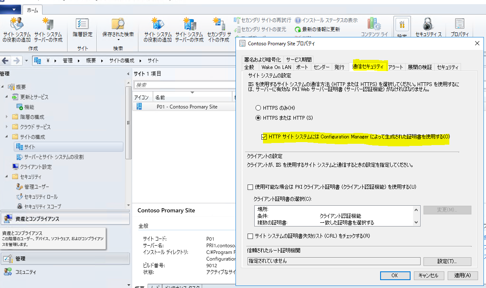

みなさま、こんにちは。Configuration Manager サポート チームです。

Microsoft Endpoint Configuration Manager (以下 MECM) 環境において、今後クライアントと Configuration Manager 間の HTTP のみの通信が非推奨となります。  
そのため、通信を HTTPS または拡張 HTTP を有効にすることで、より安全な通信方法をサイトで有効にして頂く必要がございます。

[Configuration Manager から削除された機能と非推奨の機能](https://docs.microsoft.com/ja-jp/mem/configmgr/core/plan-design/changes/deprecated/removed-and-deprecated-cmfeatures)

MECM の バージョン 2103 以降については MECM のアップグレードを行って頂く際の前提条件のチェック時においても、"警告" として、HTTP が非推奨になる旨のメッセージが表示されるようになりましたため、対処の手段である HTTPS とする方法や拡張 HTTP を有効にするための情報をご案内します。

## サイトで HTTPS を有効にする方法について

通信を PKI の証明書を利用して、 HTTPS とする場合には以下の 3 つの設定変更が必要です。

- クライアントと通信を行うための役割である管理ポイント、配布ポイント、ソフトウェア更新ポイントをサイトシステムのプロパティ上で HTTPS を受け入れる設定に変更を行う。

- IIS で HTTPS 通信を受け入れるように Web サーバー証明書を準備し、対象の IIS のサイトにバインドする。

[IIS を実行するサイト システム用の Web サーバー証明書の展開](https://docs.microsoft.com/ja-jp/mem/configmgr/core/plan-design/network/example-deployment-of-pki-certificates#deploy-the-web-server-certificate-for-site-systems-that-run-iis)

- MECM クライアント にクライアント認証用途のコンピューター証明書を配布する。

[Windows コンピューター用のクライアント証明書の展開](https://docs.microsoft.com/ja-jp/mem/configmgr/core/plan-design/network/example-deployment-of-pki-certificates#deploy-the-client-certificate-for-windows-computers)

## サイトで 拡張 HTTP を有効にする方法について
PKI 証明書を発行できる環境がない、または 管理が大変などの事情があるお客様向けに Configuration Manager の機能で通信を保護する機能が拡張 HTTP となります。

拡張 HTTP の主な目的は以下の通りです。
- PKI サーバー認証証明書を必要とせずに機密性のクライアント通信を保護できる。
- クライアントは、ネットワーク アクセス アカウント、クライアント PKI 証明書、Windows 認証を必要とせずに、配布ポイントからコンテンツに安全にアクセスできる。

[拡張 HTTP](https://docs.microsoft.com/ja-jp/mem/configmgr/core/plan-design/hierarchy/enhanced-http)

また、拡張 HTTP 環境の構成手順についてはサイトのプロパティより、 [HTTP サイト システムには Configuration Manager によって生成された証明書を使用する] オプションを有効にするだけになります。

お客様の環境によって、上記手段のご検討を頂けますようお願い申し上げます。