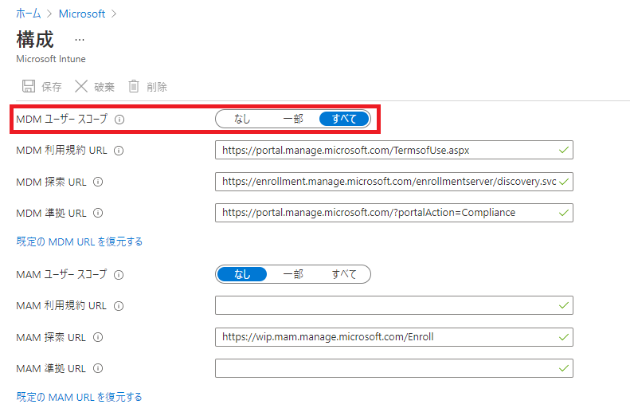

# Windows 365 Business のプロビジョニングが長時間経過しても終了しない場合について

みなさま、こんにちは。Microsoft Endpoint Manager サポート チームです。
本日は多くの皆様からお問い合わせを頂いております、Windows 365 Business　のプロビジョニングが長時間経過しても終了しない場合に、
ご確認いただきたい内容についてお伝え致します。

## 免責事項

下記内容は 2021/8/11 時点で判明している内容についての記載となっております。今後内容が更新されることもございますので、その点ご承知置きくださいますよう
お願い致します。

## 対象読者

Windows 365 Business のプロビジョニングが長時間経過しても終了しないお客様。
(Windows 365 Enterprise とは異なりますのでご注意ください)

## プロビジョニングが完了しない場合のチェック事項

以下の点についてご確認くださいませ。

(1) "CloudPCBPRT" ユーザーの確認
(2) Azure AD の デバイス 登録設定の確認
(3) Intune の自動登録設定

### "CloudPCBPRT" ユーザーの確認

初めてお客様が Azure AD テナントに Windows 365 ライセンスを割り当てた際、ご利用の Azure AD テナントに "CloudPCBPRT" という名前のユーザー ID が自動生成されます。
本 ID は Windows 365 Business の クラウド PC のプロビジョニングに必要な ID ですので、絶対に削除しないでください。

上記につきましては、下記URLにも注意事項として記載がございます。
https://docs.microsoft.com/en-us/microsoft-365/admin/setup/get-started-windows-365-business?view=o365-worldwide#assign-licenses-to-users

完全削除されていない場合は、下記にご案内します手順で復旧できますが、
完全削除してしまった場合はお手数をお消して恐縮でございますが、サポート チケットをご依頼くださいますようお願い致します。

こちらの ID の存在は下記からご確認可能です。

#### "CloudPCBPRT" の表示

1. Azure ポータルにログインする。 (https://portal.azure.com/)
2. [Azure Active Directory] を選択する。
3. [ユーザー] を選択する。
4. [すべてのユーザー (プレビュー)] が選択されていることを確認する。
5. [ユーザーの検索] に "CloudPCBPRT" を入力し、ユーザー　が表示されることを確認する。

#### "CloudPCBPRT" を完全削除していない場合の復帰

1. Azure ポータルにアクセスする。 (https://portal.azure.com/)
2. [Azure Active Directory] を選択する。
3. [ユーザー] - [削除されたユーザー(プレビュー)] を選択。
4. [CloudPCBPRT] を選択後,「ユーザーの復元」を選択し、「OK」をクリック。

### Azure AD の デバイス 登録設定の確認

デバイスを Azure AD に参加させる際の登録設定が下記の通りとなっていることを確認ください。

1. Azure ポータルにログインする。 (https://portal.azure.com/)
2. [Azure Active Directory] を選択する。
3. [デバイス] を選択する。
4. [デバイスの設定] を選択する。
5. [Azure AD を使用してデバイスを登録または参加させるには Multi-Factor Authentication が必要です] が「いいえ」 に設定されていることを確認する。

### Azure AD の Multi-Factor Authentication 設定の無効化

デバイスを Azure AD に参加させる際のMulti-Factor Authentication 認証 (多要素認証) につきましては下記手順で
無効化されていることをご確認くださいますようお願い致します。

1. Azure ポータルにログインする。 (https://portal.azure.com/)
2. [Azure Active Directory] を選択する。
3. [デバイス] を選択する。
4. [デバイスの設定] を選択する。
5. [ユーザーはデバイスを Azure AD に参加させることができます] が 「すべて」 に設定されていることを確認する。
6. [Azure AD を使用してデバイスを登録または参加させるには Multi-Factor Authentication が必要です] が「いいえ」 に設定されていることを確認する。

### Intune の自動登録設定

Intune をご利用されている場合、自動登録が有効になっている場合がございます。自動登録が有効になっている場合、"CloudPCBPPRT" ユーザーに Intune のライセンスを
付与する必要がございます。Intune をご利用されていない場合、自動登録が無効化されていることをご確認ください。

#### Intune の自動登録が有効になっている場合の確認

1. Azure ポータルにログインする。 (https://portal.azure.com/)
2. [Azure Active Directory] を選択する。
3. [モビリティ MDM および MAM] を選択する。
4. [Microsoft Intune] を選択する。
5. [MDM ユーザー スコープ]が「すべて」となっていることを確認する。

6. Azure ポータル画面に戻る。
7. [Azure Active Directory] を選択する。
8. [ユーザー] を選択する。
9. [すべてのユーザー (プレビュー)] が選択されていることを確認する。
10. [ユーザーの検索] に "CloudPCBPRT" を入力し、ユーザー　が表示されることを確認する。
11. "CloudPCBPRT" ユーザーを選択する。
12. [ライセンス] を選択し、Intune を含むライセンスが割当たっていることを確認する。
13. 割当たっていない場合、[割り当て] を選択し、Intune を含むライセンスを割り当てる。

#### Intune の自動登録が無効になっている場合の確認

1. Azure ポータルにログインする。 (https://portal.azure.com/)
2. [Azure Active Directory] を選択する。
3. [モビリティ MDM および MAM] を選択する。
4. [Microsoft Intune] を選択する。
5. [MDM ユーザー スコープ]が「なし」となっていることを確認する。

## 上記実施後の再プロビジョニング手順について

Windows 365 Business は新しいユーザーを作成して、ライセンスの再割り当てを実施することでプロビジョニングのリトライが
実施されます。上記実施後や、上記設定に問題が無いがプロビジョニングが完了しない場合は下記手順をお試しください。

1. Microsoft 365 管理センター (https://admin.microsoft.com/) にアクセスする。アカウントが要求された場合は管理者アカウントのIDとパスワードでログインする。
2. 画面左ペインより [課金情報] - [ライセンス] を選択し、ご利用の Windows 365 for Business サブスクリプションを選択する。
3. 現在ライセンス割り当てを行っているユーザーを選択し、「ライセンスの割り当て解除」を行う。
4. しばらく時間をおく。(30分程度推奨)
5. 画面左ペインより [ユーザー] - [アクティブなユーザー] を選択し [ユーザーの追加]をクリックする。
6. ウィザードに従ってユーザーの追加を完了する。
7. 画面左ペインより [課金情報] - [ライセンス] を選択し、ご利用の Windows 365 for Business サブスクリプションを選択する。
8. 上記画面で「ライセンス割り当て」をクリックし、新規に作成したユーザーを設定する。
9. https://windows365.microsoft.com/ にアクセスし、プロビジョニング完了を待機する。通常は1-2時間程度でプロビジョニングが完了する。

## 上記実施後もプロビジョニングが成功しない場合について

上記実施いただいてもプロビジョニングが完了しない場合、お手数をおかけして恐縮でございますが、サポートリクエストの発行をお願い致します。

