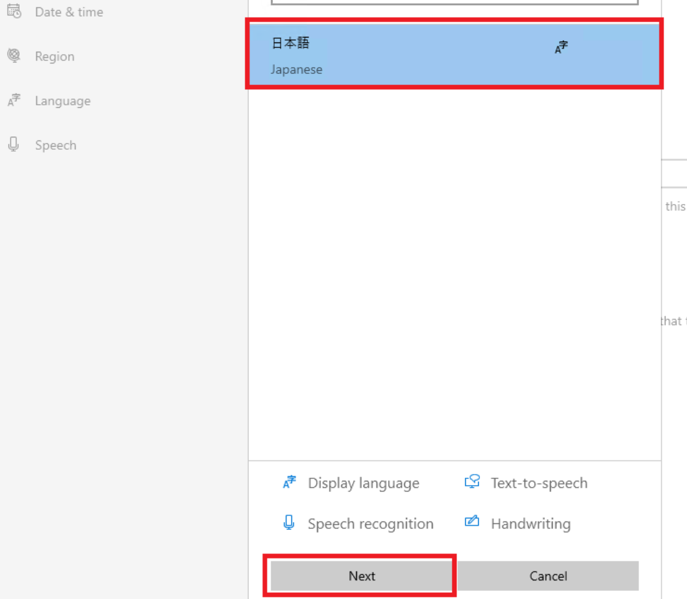
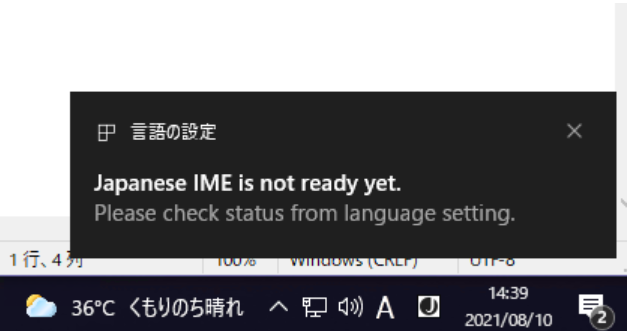
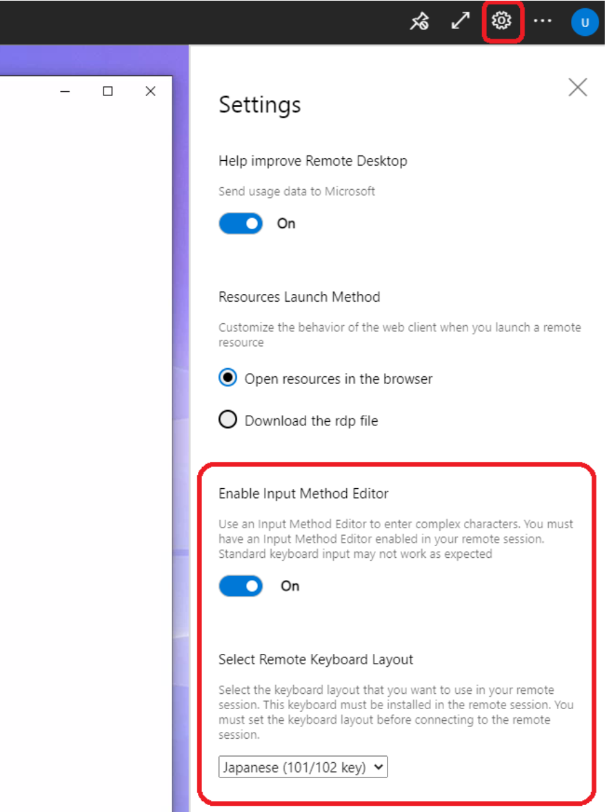

# Windows 365 Cloud PC を日本語化する手順

みなさま、こんにちは。Microsoft Endpoint Manager サポート チームです。  

本日は Windows 365 でプロビジョニングした Cloud PC を日本語化する手順をご紹介します。  
Windows 365 Enterprise の場合は、カスタム イメージを登録できますので、日本語化したイメージをプロビジョニングすれば、最初から日本語化された Cloud PC を利用できることになりますが、Windows 365 Business の場合は、カスタム イメージを使用することができず、英語版の Windows が動作する Cloud PC を利用することになります。

日本語化するための方法に関するお問い合わせも多くいただいておりますので、ここでは Windows 365 Business で用意した Cloud PC を日本語化する手順の例をご紹介します。

## 免責事項

下記内容は 2021/8/20 時点の内容についての記載となっております。今後内容が更新されることもございますので、その点ご承知置きくださいますようお願い致します。

## 手順
1. https://windows365.microsoft.com にアクセスし、Cloud PC を利用可能なユーザーでサインインして Cloud PC にログインします。

2. スタート メニューより歯車のマークを選択し、[Settings] を立ち上げます。

   

3. [Time & Language] を選択します。

   

4. [Date & time] の [Time zone] を "(UTC +09:00) Osaka, Sapporo, Tokyo" に設定します。

   

5. [Region] を選択し、[Region] を "Japan"、[Regional format] を "Japanese (Japan)" に設定します。

   

6. [Language] - [Add a language] を選択します。

   

7. "Japanese" を追加し、[Next] をクリックします。

   

8. 下記のように選択し、[Install] をクリックします。

   

9. 言語パックのインストールが開始されます。インストールが完了すると、下記のように通知されるため、[Yes, sign out now.] を選択し、一旦サインアウトします。

   

10. 再度 Cloud PC にサインインし、管理者として実行にて起動した PowerShell コンソールで、以下のコマンドを実行し、システム ロケールを ja-JP に変更します。  
```powershell
Set-WinSystemLocale -SystemLocale ja-JP
```

11. スタート メニューより歯車のマークを選択し、[設定] を立ち上げ直します。

   

12. [時刻と言語] を選択します。

   

13. [言語] - [日本語] を選択して [オプション] をクリックします。

    

14. ハードウェア キーボード レイアウトより [レイアウトを変更する] を選択して、日本語キーボードをご利用の場合は、設定を変更して [今すぐ再起動する] を選択し、再起動を行います。

    

15. 再起動後に接続することで、日本語入力が出来ないか、ご確認ください。なお、IME の準備が整ってない場合、IME の切り替え時に下記のような通知が行われますため、この場合、数分程度お待ちいただけますと幸いです。

    

16. ブラウザから利用する場合には、PC に接続後、下記の設定も有効化してください。

   4