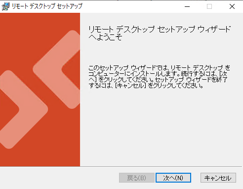
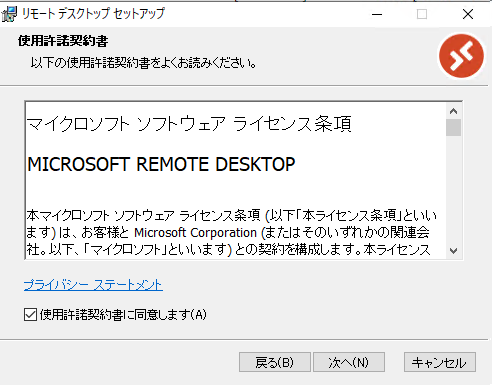
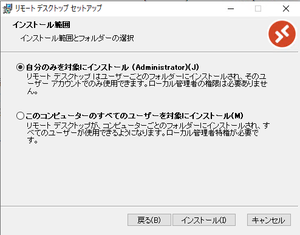
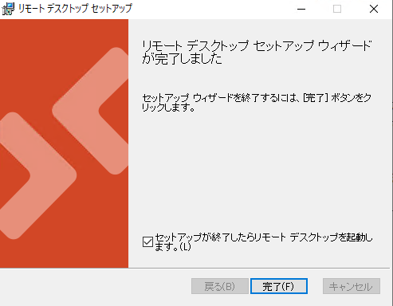
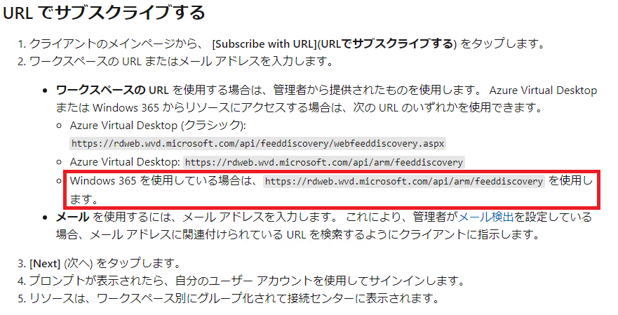
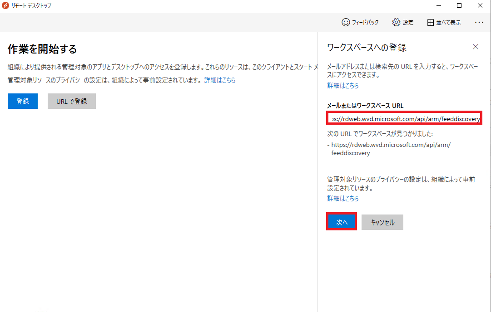
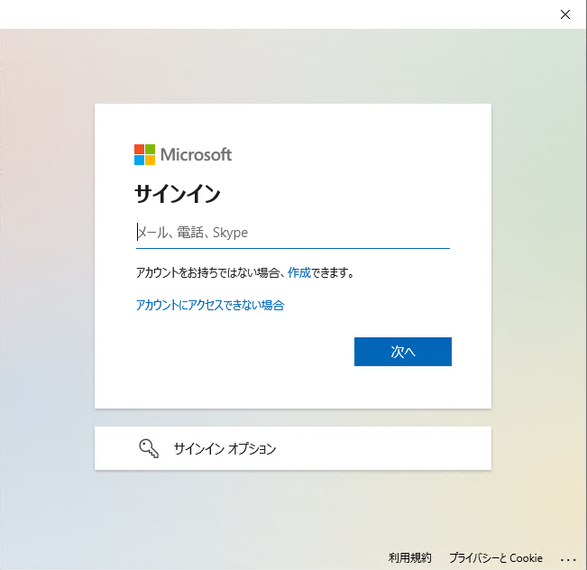
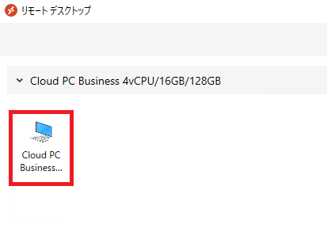
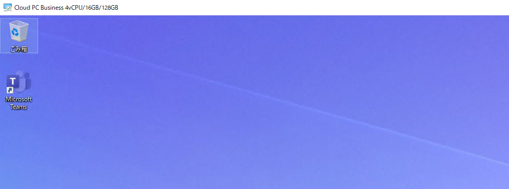

# Windows 365 用にリモート デスクトップ クライアントをセットアップする手順
みなさま、こんにちは。Microsoft Endpoint Manager サポート チームです。
本日は、Windows 365 に接続する際に、リモート デスクトップ クライアントをセットアップする手順についてご案内します。

## 免責事項

下記内容は 2021/9/13 時点で判明している内容についての記載となっております。今後内容が更新されることもございますので、その点ご承知置きくださいますようお願い致します。

## リモート デスクトップ クライアントを利用する理由

Windows クライアントから Windows 365 に接続するクライアントには、ブラウザのWeb クライアント、リモートデスクトップ クライアント、およびストア アプリのリモート デスクトップ クライアントがございますが、下記URLに記載の通り、各種デバイスのリダイレクション機能についてはそれぞれでサポート範囲が異なります。

https://docs.microsoft.com/en-us/windows-365/manage-rdp-device-redirections#redirection-support

2021/9/13時点では最も制約が少ないクライアントがリモート デスクトップ クライアントとなります。
以下では、こちらのクライアントのことを MSRDC と呼びます。

なお、従来よりリモート デスクトップ接続用途にご利用頂いております、mstsc は Windows 365への接続が出来ません。

## リモート デスクトップ クライアント (MSRDC) の URL

下記ページにて MSRDC をご紹介しております。
https://docs.microsoft.com/ja-jp/windows-server/remote/remote-desktop-services/clients/remote-desktop-clients

## リモート デスクトップ クライアント (MSRDC) のダウンロード

下記ページにてご利用のPCのアーキテクチャに合ったものをダウンロードください。

https://docs.microsoft.com/ja-jp/windows-server/remote/remote-desktop-services/clients/windowsdesktop#install-the-client

## リモート デスクトップ クライアント (MSRDC) のインストール

1. ダウンロードしたMSIファイルを開くとインストール ウィザードが開きます。「次へ」をクリックします。  

2. 「マイクロソフト ソフトウェア ライセンス条項」をご確認の上、「使用許諾契約書に同意します」にチェックを入れ、「次へ」をクリックします。  

3. ご利用のユーザーの範囲を選択して、「インストール」をクリックします。  

4. インストール画面の表示後、インストールが完了します。「完了」ボタンをクリックします。  

## リモート デスクトップ クライアント (MSRDC) の接続設定

1. MSRDC を初回起動すると、下記の画面が表示されます。「URLで登録」を選択します。  

2. 下記ページで案内されているWindows 365 のサブスクライブ ページ (https://rdweb.wvd.microsoft.com/api/arm/feeddiscovery) を登録し、「次へ」をクリックします。

https://docs.microsoft.com/ja-jp/windows-server/remote/remote-desktop-services/clients/windowsdesktop#subscribe-with-url

3. 認証ページが表示されるので、Windows 365 ライセンスを割り当てたアカウントで認証を行います。

4. 登録が完了すると、ライセンスに割り当てられている Windows 365 クラウドPCが表示されます。

## リモート デスクトップ クライアント (MSRDC)への接続

1. MSRDCを起動し、表示されているクラウド PCをダブルクリックします。

2. クラウド PCの接続アカウント情報の入力を求められます。

3. 認証に成功するとクラウド PCへ接続できます。

