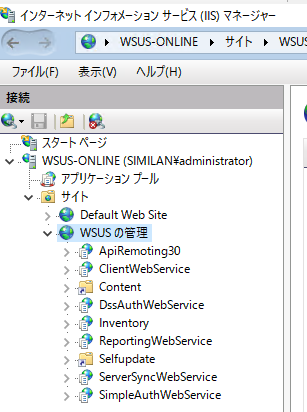
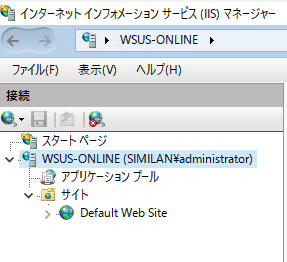

皆さま こんにちは。 WSUS サポートチームです。
本日は Windows Server 2012 上の WSUS 4.0 にてポート番号を 8530 から 80 に変更する方法をご紹介します。
WSUS 3.0 SP2 までは既定のポートは 80 番であり、インストール中に変更可能でしたが、Windows Server 2012 にて WSUS 4.0をインストールすると、既定のポートは 8530 番となりインストール中に変更することは出来ません。
運用環境上、既定の 8530 番から 80 番へ変更する必要がある場合には、この手順をご活用ください。

【 操作手順 】
1. WSUS サーバーにて [インターネット インフォメーション サービス(IIS) マネージャー] を起動します。

2. 左ペイン [サイト] に [Default Web Site] と [WSUS の管理] があることを確認します。

※ Point ※
[Default Web Site] と [WSUS の管理] がある場合： ポート 8530 番が設定されています。
[Default Web Site] のみある場合： 既にポート 80 番が設定されています。

3. コマンドプロンプトを管理者権限で実行し、以下のコマンドを入力します。
"C:\Program Files\Update Services\Tools\wsusutil.exe" UseCustomWebSite false

4. 実行後「ポート番号の使用： 80」 と表示されることを確認します。

5.  [インターネット インフォメーション サービス(IIS) マネージャー] - [サイト] にて [Default Web Site] のみ表示されていることを確認します。

※ 環境によっては、[WSUS の管理] サイトが残ることもございますが、異常ではございません。

< 参考情報 >
Step 3: Configure WSUS
https://technet.microsoft.com/en-us/library/hh852346.aspx

<補足情報>
元に戻す (8530/8531) 場合は、次のコマンドを実行してください。(true を引数に指定します。)

"C:\Program Files\Update Services\Tools\wsusutil.exe" UseCustomWebSite true

※ 弊社公式情報ではなく英語の記事ですが、Configuration Manager 2007 と 2012 間での RegKeyToMof 使用方法の違いが記載されているため、少しでもお役に立てばと思い紹介させていただきます。
コミュニティにおけるマイクロソフト社員による発言やコメントは、マイクロソフトの正式な見解またはコメントではありません。