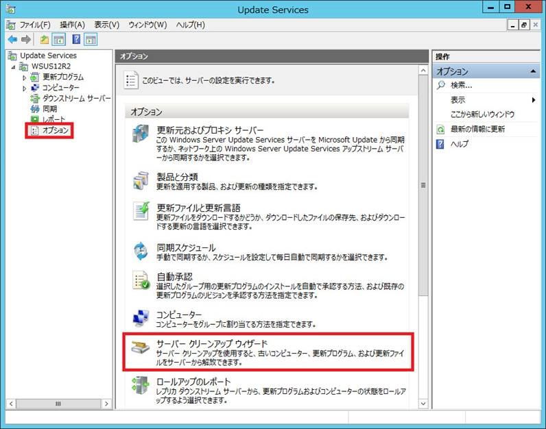
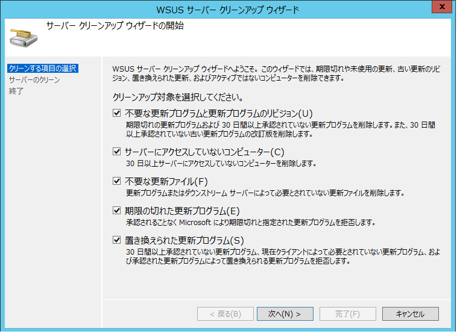
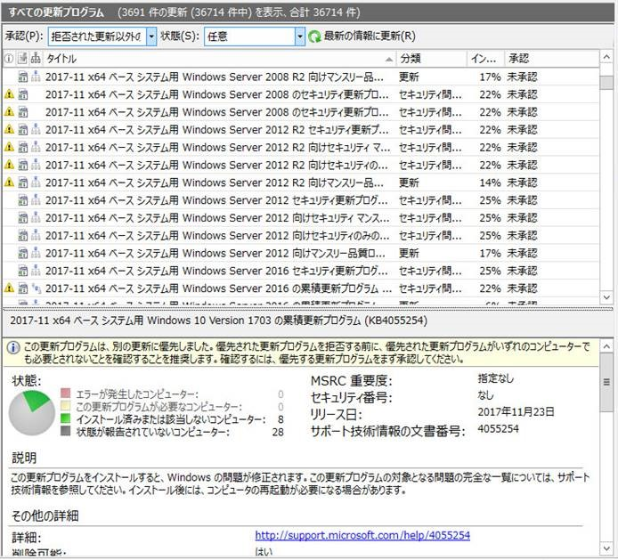

# WSUS のクリーンアップ ウィザードについて

こんにちは。WSUS サポート チームです。  

今回は WSUS のオプションより実行する、クリーンアップ ウィザードについて紹介いたします。クリーンアップ ウィザードは WSUS の運用を行う上で、メンテナンスの一環として**必ず定期実行**することをお勧めしているので、WSUS の運用を行われている方は、是非ご一読ください！  

クリーンアップ ウィザードは、管理コンソールのオプションの下記の箇所から実行することができ、

実行しようとすると以下の 5 つの項目が選べます。

いずれの項目も、WSUS で保持されている更新プログラムのデータや、コンピューターの情報を整理・削除するための処理を実行するものとなりますが、実際に何が実行されるのか、なかなか分かりづらいですよね。

これを理解するためには、WSUS が保持する更新プログラムのデータの種類が、2 種類あることを事前に知っておく必要があります。具体的には下記の 2 種類です。

**(a) WSUS データベース内のメタデータ**
データベース内に保持される更新プログラムの情報です。WSUS 管理コンソール上に表示される下記のような更新プログラムの情報は、このメタデータの情報を元に表示しています。

 

**(b) コンテンツ ファイル (更新プログラムのインストーラー本体)**
WSUSContent フォルダ内に格納されている更新プログラムのインストーラー本体等のファイルです。これらのファイルは実際にクライアントにて更新プログラムがインストールされる際に利用されます。
WSUS 上では、WSUSContent フォルダ配下にコンテンツ ファイルが保存されています。

以上を踏まえて、各項目の処理の詳細について説明していきます。

## ①「不要な更新プログラムと更新プログラムのリビジョン」
「不要な更新プログラムと更新プログラムのリビジョン」はメタデータの削除を行う唯一の項目です。削除対象となる更新プログラムのメタデータが削除されます。

具体的には下記の 2 つの条件を「同時に」満たす場合に、該当する更新プログラムの情報がデータベースから削除されます。 

**条件**  
- 期限切れの更新プログラム (弊社にて公開を停止した更新プログラム)  
- 30日以上承認されていない更新プログラム  (30日間以上、承認ステータスが変化していない更新プログラム)  

**注意**  
「他の更新プログラムにバンドルされている更新プログラム」や「他の更新プログラムの前提条件となっている更新プログラム」は、削除の対象外となります。上述のとおり「期限切れ (弊社にて公開を停止)」が設定されていない更新プログラムのレコードは、データベースからの削除対象とはなりません。

## ② 「サーバーにアクセスしていないコンピューター」
30日以上サーバーにアクセスしていないコンピュータの情報がデータベース上から削除されます。

## ③ 「不要な更新ファイル」
現時点で不要なコンテンツ ファイルを WSUSContent フォルダ内から削除します。

具体的には、「拒否済み」に設定されている更新プログラムのファイル、および、言語のオプションなどの設定変更の経緯により、現時点では不要と判断されるファイルが対象となります。

## ④ 「期限の切れた更新プログラム」
承認されない状態のまま期限切れとなった更新プログラムを「拒否済み」に設定します。この処理は、メタデータの更新であり、データベース内からメタデータの削除を実行するわけではありません。

## ⑤ 「置き換えられた更新プログラム」
下記の3つの条件を「同時に」満たす場合にのみ、該当する更新プログラムを「拒否済み」に設定します。この処理は、メタデータの更新であり、データベース内からメタデータの削除を実行するわけではありません。

**条件**  
- 30日間以上承認されていない更新プログラム
- 現在クライアントによって必要とされていない更新プログラム
- 承認された更新プログラムによって置き換えられる更新プログラム