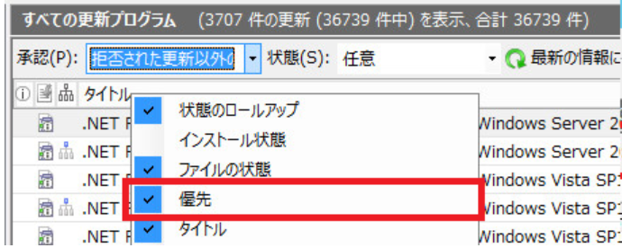
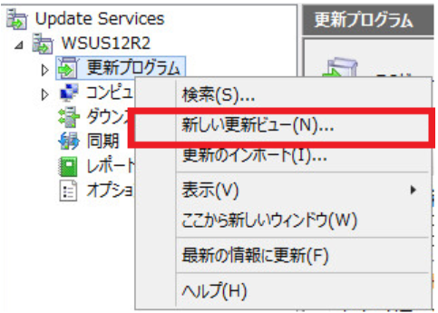

# 不要な更新プログラムは「拒否済み」に設定しよう！

みなさま、こんにちは。WSUS サポート チームです。

今回は WSUS で設定出来る、更新プログラムの「拒否済み」の設定について、詳細を紹介いたします。


「そんなこと知ってどうするんだ…」と思われるかも知れませんが、WSUS はその性質上、過去にリリースされた更新プログラムの情報が、どんどん蓄積されてしまうシステムです。そのため、運用を行う上で、不要な更新プログラムを継続的に「拒否済み」に設定していき、不要な処理を実行させないようメンテナンスしていくことが非常に重要となります。本記事では、その詳細について説明していきます。

 

## 「拒否済み」とは？
「拒否済み」は、いわば「論理的な削除状態」です。具体的な他の承認状態との違いは、以下の通りとなります。

|承認状態        |クライアントへの配信                   |レポート情報の収集|設定の単位                 |
|:--------------:|:-------------------------------------:|:----------------:|:-------------------------:|
|インストール承認|配信される                             |収集される        |コンピューター グループ単位|
|未承認 (既定)   |配信されない                           |収集される        |コンピューター グループ単位|
|削除の承認      |配信されない (アンインストールがされる)|収集される        |コンピューター グループ単位|
|**拒否済み**    |**配信されない**                       |**収集されない**  |**WSUS サーバー全体**      |
 

「拒否済み」に設定すると、「未承認」状態と同じくクライアントへの配信は行われませんが、レポート情報の収集も行わなくなります。この点が他の承認状態との大きな違いです。逆に言うと更新プログラムを WSUS 上で「拒否済み」に設定しない限り、実はクライアントや WSUS サーバーでは、レポート情報を収集するための処理を実行し続けることになります。

ちなみに一度「拒否済み」に設定した更新プログラムでも、他の承認状態に任意のタイミングで変更し、再度配信等を実施することは可能ですので、その点はご安心ください。

 

## 「拒否済み」に設定すると何が嬉しいの？
更新プログラムを「拒否済み」に設定することの、具体的なメリット・デメリットは下記の通りとなります。

1 ~ 2 件の更新プログラムを「拒否済み」に設定したところで大きな効果が得られるわけではありませんが、WSUS は数千から数万件の更新プログラムを管理することが当たり前なので、塵も積もれば山となり、WSUS の負荷やディスク容量に大きな影響を与えてしまいます。

既に配信の必要がなく、レポート情報も収集する必要がない更新プログラムについては「拒否済み」に設定することにメリットしかありません。どんどん不要な更新プログラムは「拒否済み」に設定していきましょう。

 

### メリット

- クライアントや WSUS サーバーで「拒否済み」に設定した更新プログラムのレポート情報の収集が行われなくなるため、クライアントや WSUS サーバーの負荷が軽減される。
- クリーンアップ ウィザードの「不要な更新ファイル」項目の削除対象となるため、WSUS サーバーのディスク容量の消費を削減出来る。
 

### デメリット

- レポート情報の収集が行われなくなるため、クライアントへ適用が行われているか、配信が必要であるか、WSUS 上のレポートから確認出来なくなる。
- WSUS 全体での設定となるため、一部のコンピューター グループだけを「拒否済み」にすることは出来ない。
 

## どうやって「拒否済み」に設定する更新プログラムを選べばいいの？
では、具体的にどうやって「拒否済み」に設定する更新プログラムを選んでいくか紹介していきます。一般的には下記の方法があります。

 

A. クリーンアップ ウィザードを実行する

B. 置き換えが行われた更新プログラムを「拒否済み」に設定する

C. 不要となった分類や製品の更新プログラムを「拒否済み」に設定する

 

「 A 」 については、このブログで詳細を紹介しているので、こちらを参照してください。「期限の切れた更新プログラム」と「置き換えられた更新プログラム」が、更新プログラムを「拒否済み」に設定する項目となります。

「 B 」「 C 」 については、本ブログで詳細な手順を紹介していきます。

 

## B. 置き換えが行われた更新プログラムを「拒否済み」に設定する
更新プログラムの中には、より新しい置き換えが行われた更新プログラムがリリースされているものがあります。このような更新プログラムは、新しい方の更新プログラムが WSUS から配信されれば、古い方の更新プログラムを配信しなくても、クライアントとしては最新のセキュアな状態となります。

このため、「クライアントが最新の状態になれば問題ない」という方針で運用されている場合には、置き換えが行われた更新プログラムを「拒否済み」の設定対象とすることが可能です。

WSUS 管理コンソールでは、既に置き換えが行われた更新プログラムを管理コンソールから一括して判別が出来るので、下記の手順で置き換えが行われた更新プログラムを纏めて「拒否済み」に設定しましょう。

**※ 注意 : 最新の更新プログラムを配信する方針 (数ヶ月遅れで更新プログラムを配信する等) でご運用されていない場合には、本手順を実施しないでください。本手順は最新の更新プログラムを配信する方針で運用している環境を前提としております。**

 

- 手順

1. WSUS サーバーで、[管理ツール] の [Windows Server Update Services] を開きます。
2. [すべての更新プログラム] で、下記のようにフィルターを選択し、[最新の情報に更新] を選択します。


3. 中央画面の項目バー（タイトル、承認等が表示されているバー）を右クリックし、[優先] にチェックを入れます。



[優先] の項目（ピラミッド型のアイコン） が表示されますので、当該項目をクリックして、ソートします。
 
もしくは

のアイコンを持つ更新プログラムは、既に新しい更新で置き換えが行われており、「拒否済み」対象と判断できます。※ 下記の 3 種類のアイコンがあります。アイコンの表示がない更新プログラムは、置き換え関係を持つ更新がないので承認する必要があります。

: 置き換え関係を持つ更新プログラムの中で、最新の更新プログラムです。承認する必要があります。

: より新しい更新プログラムと、より古い更新プログラムの双方が存在する更新です。「拒否済み」に設定します。

: 置き換え関係を持つ更新プログラムの中で、最も古い更新プログラムです。「拒否済み」に設定します。


もしくは

のアイコンを持つ更新プログラムを選択し、[右クリック] - [拒否] をクリックすることで、「拒否済み」に設定します。
※ Ctrl や　Shift を押しながら、選択することで一括して「拒否済み」に設定することも可能です。
 

### 【補足 : スクリプトで「拒否済み」に変更する方法】
以下のリンクで、置き換えられら更新プログラムの承認ステータスを「拒否済み」に変更するスクリプトをご提供しております。ダウンロードいただいたファイル Decline-SupersededUpdates.ps1 を WSUS 上でご利用ください。タスク スケジューラーから定期的に実行させることも可能です。

[Download](https://github.com/microsoft-jpcssmem/WSUS/releases/latest/download/Decline-SupersededUpdates.ps1)
 

(実行方法の例)
```
powershell.exe -Command C:\Temp\Decline-SupersededUpdates.ps1
```

(実行結果の例)

```
Connecting to WSUS server  on Port ... Connected.
Getting a list of all updates... Done
Parsing the list of updates... Done.
List of superseded updates: C:\Temp\SupersededUpdates.csv

Summary:
========
All Updates = 17829
Any except Declined = 4418
All Superseded Updates = 118
Superseded Updates (Intermediate) = 112
Superseded Updates (Last Level) = 6

SkipDecline flag is set to False. Continuing with declining updates
DeclineLastLevel is set to False. Declining all superseded updates.
Declined 118 updates.
Backed up list of superseded updates to C:\Temp\SupersededUpdatesBackup.csv

Done
```

## C. 不要となった製品の更新プログラムを「拒否済み」に設定する
Windows XP や Windows Server 2003 等、もう管理の必要のない OS や製品の更新プログラムが WSUS 上に同期されている状態であれば、それら「拒否済み」の設定対象としていただくことが可能でしょう。

この場合には、下記の手順で更新ビューの機能を用いて、その製品の更新プログラムだけを表示して「拒否済み」に設定すると便利です。

 

- 手順

1. WSUS サーバーで、[管理ツール] の [Windows Server Update Services] を開きます。
2. 左ペインより [Update Services] - [<WSUS サーバー名>] - [更新プログラム] を右クリックし、[新しい更新ビュー] を選択します。



3. ステップ 1 にて、[更新は特定の製品用です] にチェックを入れ、ステップ 2 の [任意の製品] をクリックします。


4. [すべての製品] のチェックを外し、「拒否済み」の設定を行いたい製品にチェックを入れ、[OK] をクリックします。
5. ステップ 3 にて、任意の更新ビューの名前を入力し、[OK] をクリックします。
6. 左ペインより [Update Services] - [<WSUS サーバー名>] - [更新プログラム] 配下に作成された更新ビューを選択し、中央ペインに対象製品用の更新プログラムのみが表示されていることを確認します。
7. 対象製品用の不要な更新プログラムを選択して右クリックし、[拒否] を実行することで 「拒否済み」に設定します。
 

※ 注意 : 拒否済みの設定対象製品の更新プログラムについて

.Net Framework 用の更新プログラム等の中には、複数の OS に跨って提供されるものがあるため、製品別に「拒否済み」に設定される場合は、ご注意ください。

複数の製品に跨って提供されている更新プログラムを一覧で識別するような方法はありませんが、更新プログラムのタイトルや下記の箇所の情報から、複数の製品に跨って提供されている、更新プログラムではないか、確認が可能です。


いかがだったでしょうか。「拒否済み」は WSUS を安定運用させるための強力な武器です。是非普段の運用の中に取り入れてみてください！