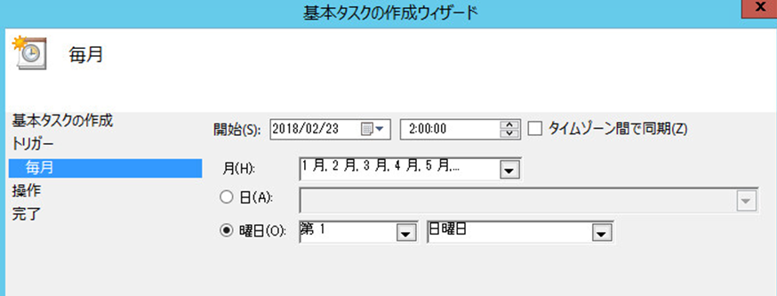

# WSUS メンテナンス ガイド
みなさま、こんにちは。WSUS サポート チームです。  
本日は WSUS サーバーのメンテナンス方法について、纏めてご紹介をいたします。

WSUS は月々リリースされる更新プログラムを配信出来るよう、更新プログラムの情報をサーバー上に溜め込む必要があります。しかし、この製品の性質上、日々メンテナンスを実施しないと、データベースや情報が肥大化し、様々な障害や弊害が発生しやすくなってしまいます。  
弊サポート部門へいただく様々なお問い合わせも、最終的にはこのいずれかの対処に行き着くことが、ほとんどですので是非 WSUS をこれから導入・構築される方々、また既に運用されている方々は、ご一読ください！

## WSUS の各種メンテナンス
一般的な WSUS のメンテナンスとして、下記の 3 種類のメンテナンスは更新プログラムのリリースと合わせて、月 1 回程度実行していただくことをオススメしております。各メンテナンスについては、既に以下のブログで、それぞれ紹介していますので、WSUS をご利用いただいている方で、まだ読んだことがない方は一度内容をご覧ください。

1. [WSUS DB インデックスの再構成の手順について](https://jpmem.github.io/blog/wsus/2014-03-05_01/)
2. [WSUS のクリーンアップ ウィザードについて](https://jpmem.github.io/blog/wsus/2017-12-05_01/)
3. [不要な更新プログラムは「拒否済み」に設定しよう！](https://jpmem.github.io/blog/wsus/2017-12-11_01/)

また、これらのメンテナンスはいずれもコマンド ライン等から実行出来るため、タスク スケジューラと組み合わせて自動化することが可能です。今回は自動化の手順とそれに伴う注意事項も紹介しますので、運用の中に取り入れる上で参考としていただけると幸いです。

## 注意事項

以下にメンテナンスを実施いただく上での注意事項をご案内します。メンテナンスの自動化を行う前に、必ずご一読ください。

- 初めてメンテナンスを実施する場合には、各メンテナンスが正常に動作することを一度必ずご確認ください。特に何年も運用しているような環境で、**初めてメンテナンスを実施する場合には、処理が長時間 (数十時間 ～) に及ぶ可能性もあるので、ご留意ください。** 
- 各メンテナンスと WSUS の同期は、なるべく同じ時刻に実行されないようにしてください。いずれのメンテナンスも WSUS の負荷が高くなる可能性があるため、各メンテナンスを同時に実行したり、**メンテナンスと同期を同時に実行すると失敗することがあります。**
- 「3」のブログで紹介している置き換えが行われた更新プログラムを「拒否済み」に設定するスクリプトを利用して貰えると、新しい更新プログラムにて置き換えられている古い更新プログラムのみを、簡単に「拒否済み」に設定することが可能です。今回ご案内の手順でも、このスクリプトを利用します。**ただし、最新の更新プログラムを常に配信するような運用をしていない場合 (リリース後 1 ヶ月遅れで配信したり、特定の更新を除外して配信しているような場合) には、配信対処の更新プログラムが「拒否済み」に設定されてしまうこともあるため、ご注意ください。**
- レプリカ構成の WSUS を利用している場合には、「2」のクリーンアップ ウィザードは上位のサーバーから実行する必要があるため、上位のサーバーから順番にメンテナンスが実行されるよう、スケジュールをしてください。 
- 階層構成の WSUS の場合でも「1」「2」のメンテナンスについては、上位下位双方の WSUS にて実施してください。なお。レプリカ構成の WSUS の場合には、「3」の「拒否済み」の設定については、上位の WSUS サーバーだけで実施すれば問題ありません。

## メンテナンスの自動化
それでは各メンテナンスを自動化する方法について、それぞれ紹介していきます。

### SUSDB のインデックス再構築をタスク スケジューラから自動実行させる
1. [こちら](https://github.com/microsoft-jpcssmem/WSUS/releases/latest/download/WsusDBMaintenance.sql)より、インデックスの SUSDB のインデックス再構築を行うスクリプトを入手し、WSUS サーバー上に保存します。(WsusDBMaintenance.sql 等)

2. スタート メニューより、タスク スケジューラを立ち上げます。

3. [基本タスクの作成] を選択し、任意の名前を付けます。

   

4. インデックスの再構築を実施するスケジュールを指定します。以下の例では、毎月第一日曜日の AM 2:00 に実行するよう指定しています。

   

5. [プログラムの開始] を選択して、以下のような指定を行ないます。以下の指定では -i オプションで手順 1 で保存したスクリプトのパスを指定し、-o にてスクリプトの実行ログの出力パスを指定しています。

Windows Server 2012 以降の WSUS で WID を利用している場合の指定例  
`"C:\Program Files\Microsoft SQL Server\110\Tools\Binn\SQLCMD.exe" -S \\.\pipe\Microsoft##WID\tsql\query -i C:\WSUS\WsusDBMaintenance.sql -o c:\WSUS\reindexout.txt`  
※ SQL Server を利用している場合には -S にて SQL Server のインスタンス名を指定します。  


6. 以下のような警告が出力されますが [はい] を選択して、そのままタスクの作成を完了させます。

   

7. 作成したタスクを右クリックして [プロパティ] を選択し、以下の 2 つの設定を行って [OK] をクリックします。

   

8. 試しに作成したタスクを右クリックして [実行する] を選択して実行してみましょう。ログを確認してエラー等が出力されておらず、最後の方に **"Statistics for all tables have been updated"** または **"全テーブルの統計が更新されました"** が出力されていれば、問題なくタスクの登録が出来ています。

### クリーンアップ ウィザードをタスク スケジューラから自動実行させる
1. インデックスの再構築の自動化の手順と同様にタスク スケジューラを起動し、基本タスクの作成を行ない、クリーンアップ ウィザードを実行するスケジュールを指定 (上述の手順 2 ~ 4) します。
※ インデックスの再構築とはスケジュールが被らないよう、インデックス再構築の実行開始の数時間後や別の日等を指定します。
2. [プログラムの開始] を選択して、実行したいクリーンアップの項目に合わせて、以下のような指定を行ないます。

Windows Server 2012 以降の WSUS で WID を利用しており、全ての項目を実行する場合の指定例  
`Powershell -Command "Invoke-WsusServerCleanup -CompressUpdates -CleanupObsoleteUpdates -CleanupObsoleteComputers -CleanupUnneededContentFiles -DeclineExpiredUpdates -DeclineSupersededUpdates" > C:\WSUS\wsusClean.txt`  
※ オプションとクリーンアップの各項目の対応については、[こちらのブログの参考情報](https://jpmem.github.io/blog/wsus/2017-12-05_01/#%E5%8F%82%E8%80%83%E6%83%85%E5%A0%B1-%E5%AE%9A%E6%9C%9F%E5%AE%9F%E8%A1%8C%E3%81%99%E3%82%8B%E5%A0%B4%E5%90%88%E3%81%AE%E8%87%AA%E5%8B%95%E5%8C%96%E3%81%AE%E6%96%B9%E6%B3%95)を参照してください、

1. インデックスの再構築の自動化の手順と同様にタスクの作成を完了 (上述の手順 6 ～ 7) させます。
2. 試しに作成したタスクを右クリックして [実行する] を選択して実行してみましょう。出力ファイルに以下のようにエラー等が出力されていなければ、正常に登録されています。
出来ています。
```
削除された古い更新プログラム:0
拒否された期限切れの更新プログラム: 0
削除された古い更新プログラム:87
圧縮された更新プログラム:0
削除された古いコンピューター:0
解放されたディスク領域:0
```
### 不要な更新プログラムの「拒否済み」設定をタスク スケジューラから自動実行させる
1. [こちら](https://github.com/microsoft-jpcssmem/WSUS/releases/latest/download/Decline-SupersededUpdates.ps1) より、置き換えられた更新プログラムを「拒否済み」に設定するスクリプトを入手し、WSUS サーバー上に保存します。(Decline-SupersededUpdates.ps1 等)
2. インデックスの再構築の時と同様にタスク スケジューラを起動し、基本タスクの作成を行ない、不要な更新プログラムの「拒否済み」設定を実行するスケジュールを指定 (上述の手順 2 ~ 4) します。  
※ こちらもインデックスの再構築やクリーンアップ ウィザードとはスケジュールが被らないよう、他のメンテナンスの実行開始の数時間後や別の日等を指定します。
3. [プログラムの開始] を選択して、以下のようにスクリプトを指定します。本指定については、利用しているポート番号によって -Port 以降の指定を変更する必要があるので、ご注意ください。Windows Server 2012 以降の WSUS 環境は既定で 8530 となります。  
`powershell -ExecutionPolicy Unrestricted -Command "C:\WSUS\Decline-SupersededUpdates.ps1 -UpdateServer localhost -Port 8530"`  
4. インデックスの再構築の自動化の手順と同様にタスクの作成を完了 (上述の手順 6 ～ 7) させます。
5. 試しに作成したタスクを右クリックして [実行する] を選択して実行してみましょう。出力ファイル SupersededUpdates.csv や SupersededUpdatesBackup.csv が出力されていれば、正常に登録されています。